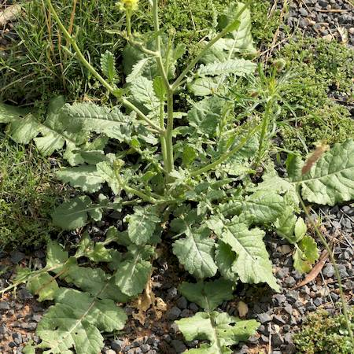
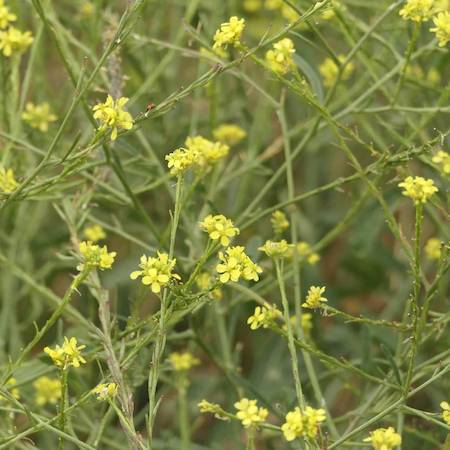
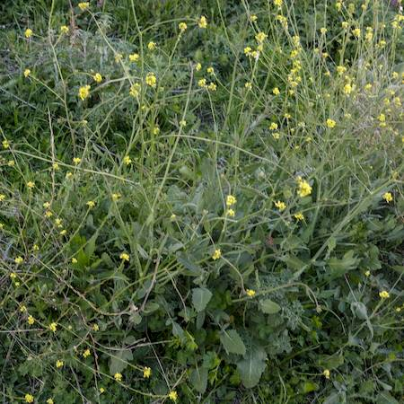

## Brassicaceae
# Hirschfeldia incana

**Plant Form** Annual or biennial erect herb. **Size** Up to 1m tall. **Stem** Green or pale green, covered in stiff bristle like hairs. **Leaves** Larger lower leaves, up to 35 cm long, smaller further up. Deeply lobed ovate shape, sometimes with toothed edges, less lobed higher up. **Flowers** Many small flowers on branching stems with 4 pale yellow petals, typical brassicaceae, but sometimes with purple veins. **Fruit and Seeds** Green, cylindrical up to 2 cm long, held closely to stalk, and usually covered in stiff hairs. Slight constrictions between small reddish-brown seeds. **Habitat** Roadsides, wasteland, grasslands, cropping areas. **Distinguishing Features** Very similar to other brassicaceae but fruit has beak at the end which resembles old fashioned clothes peg.

   *Large leaves near ground* 

   *Sprey of yellow flowers* 

   *Growth habit* 

