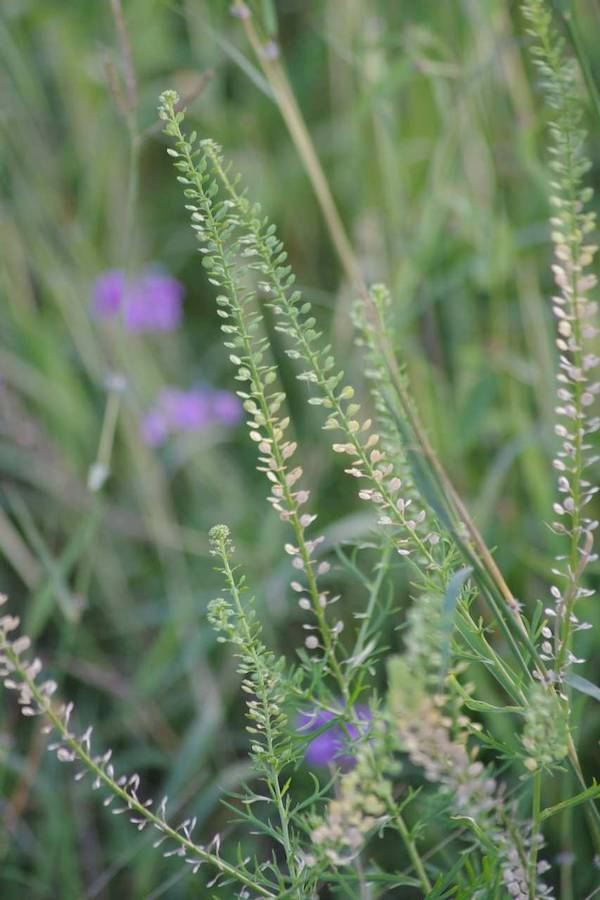
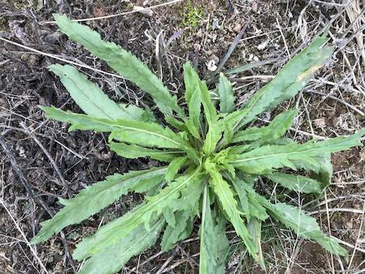
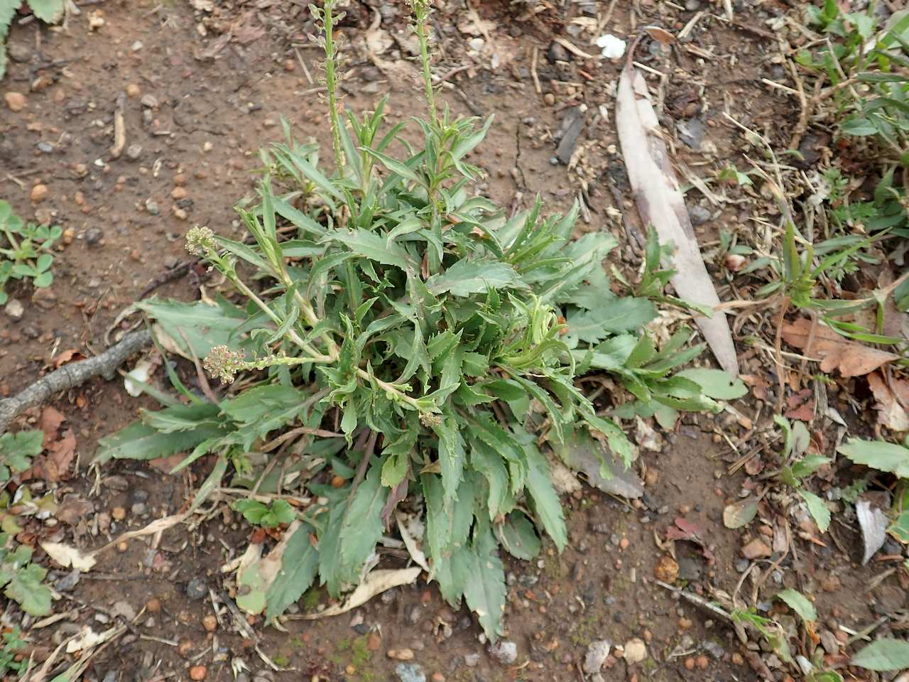
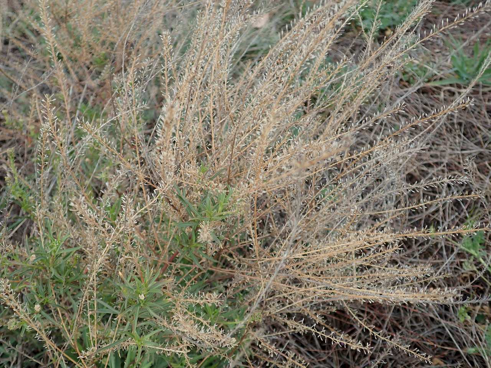

## Brassicaceae
# Lepidium africanum
 **Plant Form** Annual or perennial herb. **Size** Up to 70cm tall.

 *Seed in fine spreys* 

 *Leaf edges have pointy teeth* 

 *Growth habit* 

 *Heavily in seed* 

