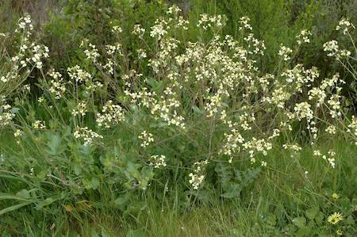

## Brassicaceae
# Raphanus raphanistrum
**common names:** wild radish

**Plant Form** Upright annual or biennial rosette herb. **Size** 40 cm to 1 m tall. **Stem** Long, thin, covered in stiff hairs. **Leaves** 15-20 cm long deeply lobed and variable at base, decreasing in size further up. **Flowers** Four yellow to white petals with purple veins in propellor shape, each petal up to 2 cm long. **Fruit and Seeds** Variable form but long and narrow 2-9 cm long on stalk 1-2.5 cm long. **Habitat** Roadsides, wasteland, vacant land. **Distinguishing Features** Fruit breaks into ribbed 1-seeded units, flowers are slightly different in appearance to most other Brassicaceae.

 *Flowers - light yellow* 

 *Leaves* 

 *Habit* 

