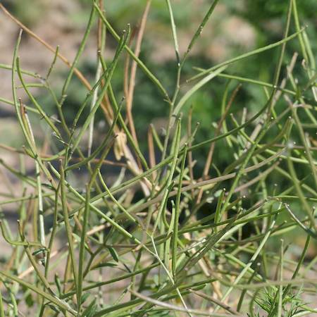

## Brassicaceae
# Sisymbrium orientale
**common names:** Indian hedge mustard

**Plant Form** Annual or biennial rosette herb. **Size** 20 cm to 90 cm tall. **Stem** Wiry, hairy, branching. **Leaves** Rosette leaves deeply divided up to 10 cm long, upper leaves less divided. Oval or lance shaped. Greyish green overall appearance. **Flowers** Typical Brassica flowers, bright yellow with 4 petals, in clusters at end of stems. **Fruit and Seeds** Long and thin spreading pods. **Habitat** Crops, pastures, rangelands, open woodlands, roadsides. **Distinguishing Features** Very hard to distinguish from other Sisymbrium but combination of characteristics.

  
 *Rosette when young* 

  
 *Flowers* 

  
 *Seed pods forming* 

  
 *Seed pods hide leaves* 

