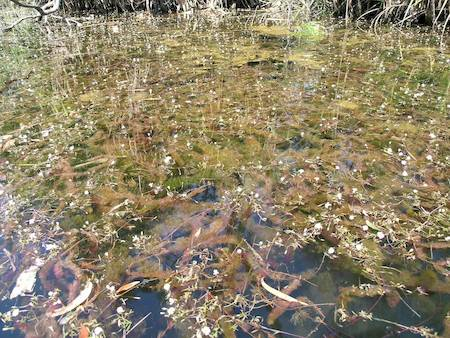

## Cabombaceae
# Cabomba caroliniana
**common names:** cabomba

**Plant Form** Aquatic perennial herb. **Size** Rooted in water 1-3 m deep. **Stem** Branched with white or reddish-brown hairs. **Leaves** Kidney shaped, in opposite pairs on stem, deeply divided giving feathery fan-like appearance. Secrete mucus that covers plant. **Flowers** Solitary 2 cm wide, white to yellow with yellow centre, usually only part of plant not submerged. **Fruit and Seeds** N/A **Habitat** Slow moving waterways like dams, ponds and irrigation channels. **Distinguishing Features** Easily confused with other aquatic species, best to consult an expert.

 *Ferny leaves* 

 *Flower* 

 *Infestation* 

