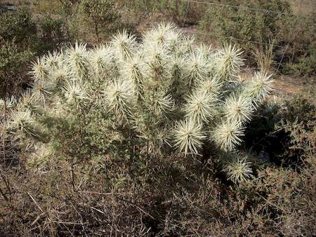
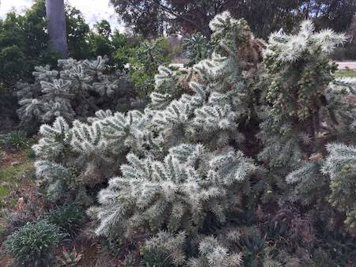

## Cactaceae
# Cylindropuntia pallida
 **Plant Form** Branched cactus. **Size** Up to 1.5 m tall and 3 m wide.

 *Medium-sized plant* 

 *Mobile segments* 

 *Large plant* 

 *Fruit* 

 *horizontal growth* 

 *Flower* 

