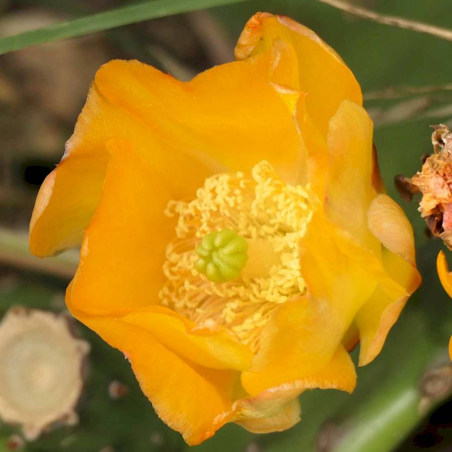
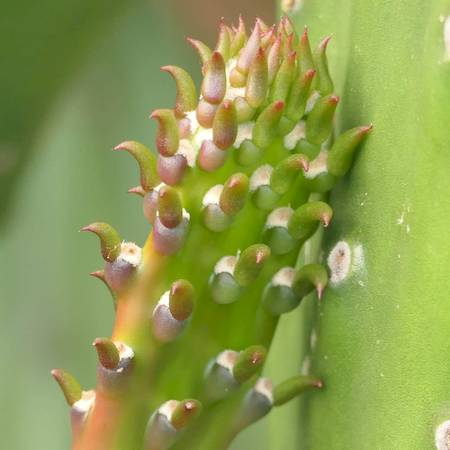
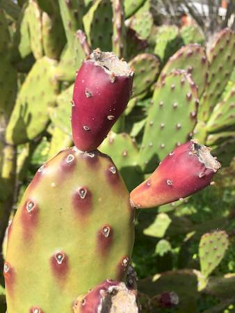
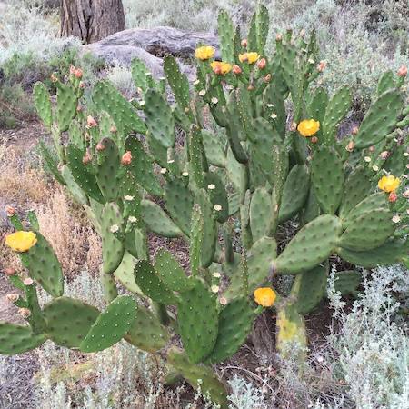

## Cactaceae
# Opuntia elata

**Plant Form** Multi branched shrubby succulent. **Size** Up to 2 m tall.

 *Yellow flowers* 

 *Few big spines or no spines* 

 *Red fruit and often red spots* 

 *Growth habit* 

