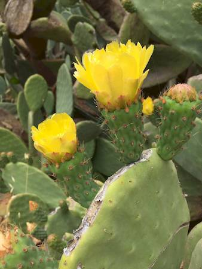
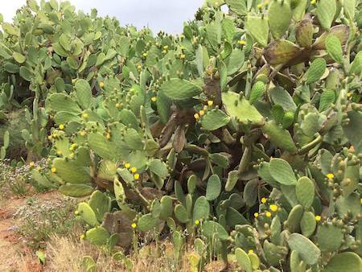

## Cactaceae
# Opuntia ficus-indica
**common names:** Barbary fig

**Plant Form** Succulent shrub or tree. **Size** Up to 5m tall.

   *Yellow flowers* 

   *Fruit* 

   *Leaves - spines are very small* 

   *Growth habit* 

