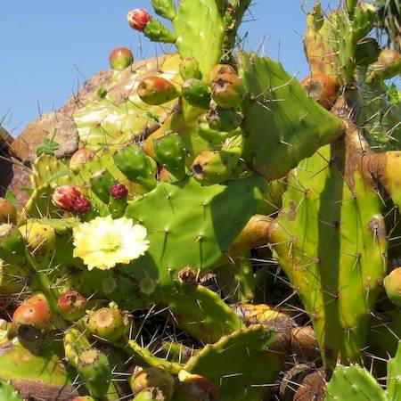
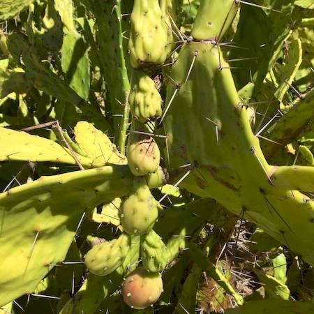

## Cactaceae
# Opuntia monacantha
**common names:** drooping prickly pear

**Plant Form** Upright succulent shrub or tree-like plant. **Size** Usually 2-3 m tall but up to 6 m.

  
 *Flowers with flecks of red* 

  
 *Has some drooping leaves* 

  
 *Leaves look sucked flat* 

  
 *Very spiny* 

  
 *Fruit* 

