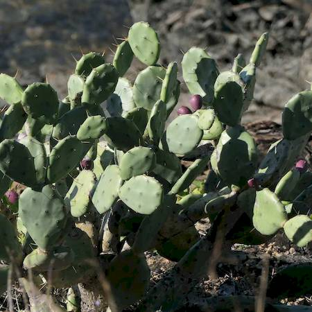

## Cactaceae
# Opuntia stricta
**common names:** erect pricky pear

**Plant Form** Upright spreading succulent shrub. **Size** 50 cm to 2 m tall.

 *Fruit* 

 *Yellow flowers* 

 *Low growth habit* 

