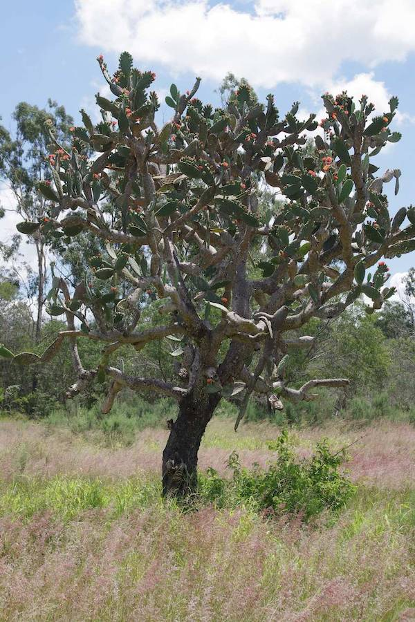
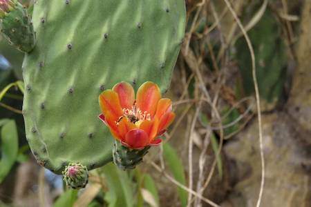
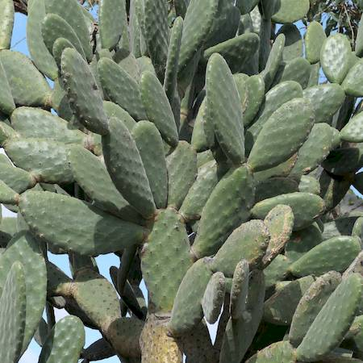
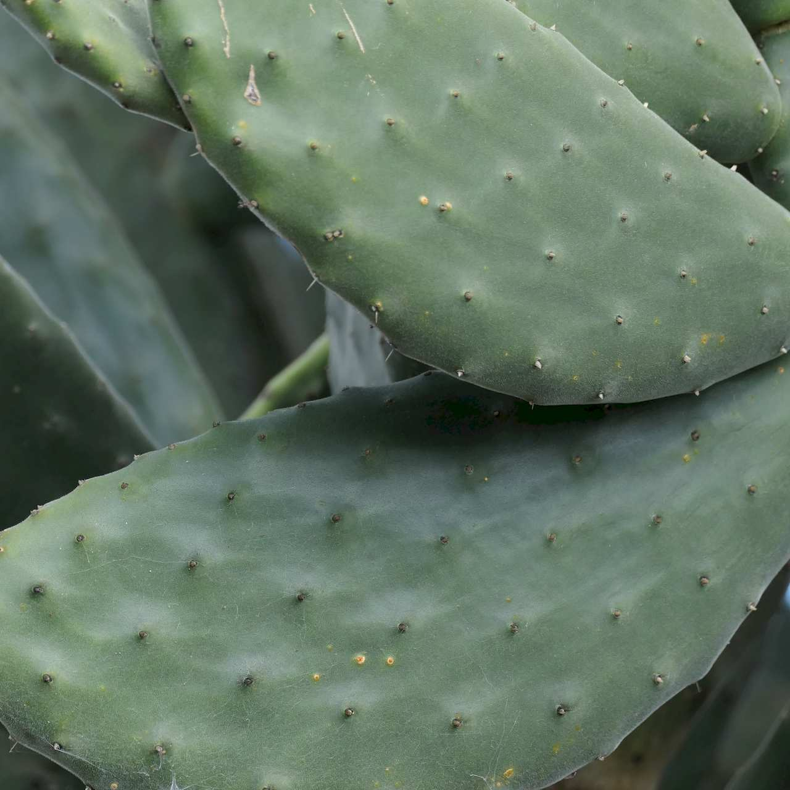

## Cactaceae
# Opuntia tomentosa

**Plant Form** Upright succulent shrub to tree-like plant. **Size** 2-8m tall.

  
 *Tree-sized cactus* 

  
 *Orange-red flowers* 

  
 *Elongate pads* 

  
 *Pads have a velvetty surface* 

