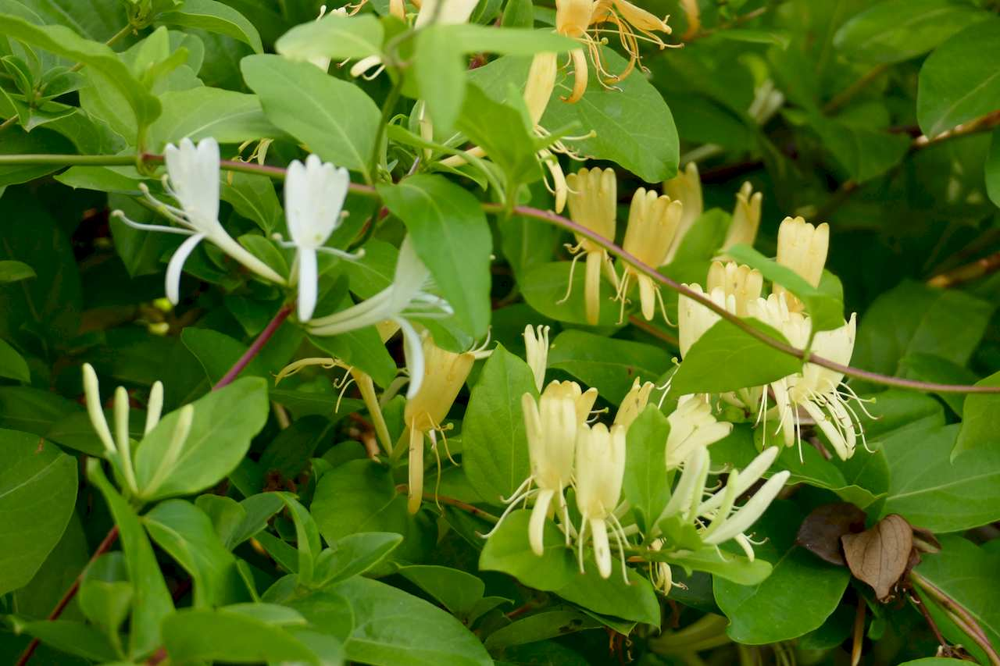
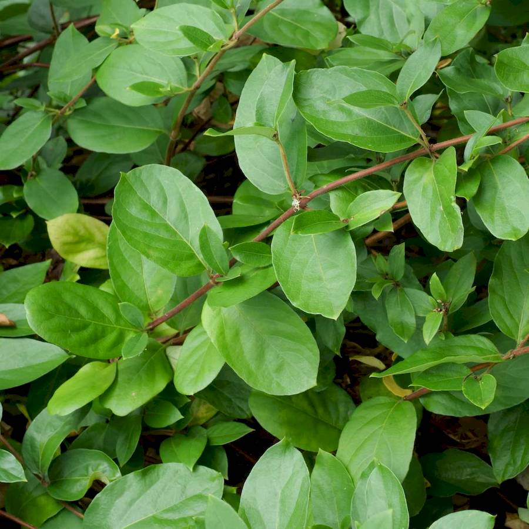
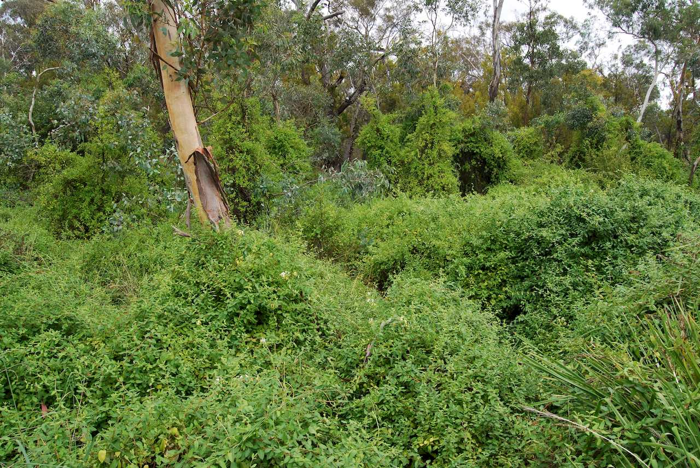
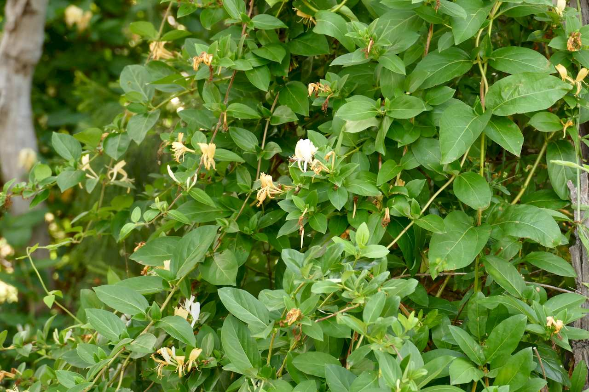

## Caprifoliaceae
# Lonicera japonica
 **Plant Form** Woody climber or scrambler. **Size** Up to 10m high when climbing. **Stem** Young stems purplish and densely hairy, older stems brown and hairless. **Leaves** Dark green upper and paler below, 3-8 cm long, oval shaped, in opposite pairs on stems, with smooth edges and sometimes deeply lobed when young. **Flowers** Tubular, white to pink, turing yellow or orange with age, in pairs at leaf bases, very fragrant. **Fruit and Seeds** Oval shaped, shiny black berries. **Habitat** Forests, woodlands, along streams, heathlands, disturbed areas. **Distinguishing Features** Unlikely to be confused when in flower.

 *Flowers are white, then yellow* 

 *Leaves* 

 *Infestation* 

 *Rambles over other plants* 

