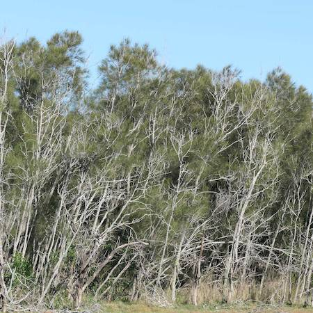
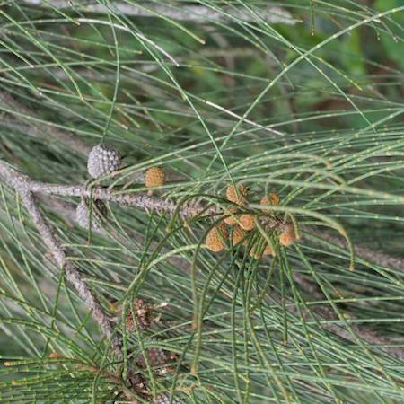

## Casuarinaceae
# Casuarina glauca
 **Plant Form** Medium tree. **Size** 8-20 m tall, sometimes taller. Can occasionally be creeper in coastal heath. **Stem** Hard grey or grey-brown, with finely cracked and scaly bark. **Leaves** Typical casuarina, tiny leaves form rings around long thin drooping branchlets in segments. **Flowers** Clusters with pollen on the tips of branchlets, male flowers are brown, female are bright red and hairy appearance. **Fruit and Seeds** Rounded cones on stalked heads, with reddish to white hairs when young, mature to woody. Release winged nutlets when mature. **Habitat** Riverbanks, floodplains, swamps, dunes. **Distinguishing Features** Very hard to distinguish from other casuarinas and can hybridise.

 *Thickets in swamps areas* 

 *Leaves are coarse and long* 

 *May have spittle bugs* 

 *Seed pods are round and average sized* 

