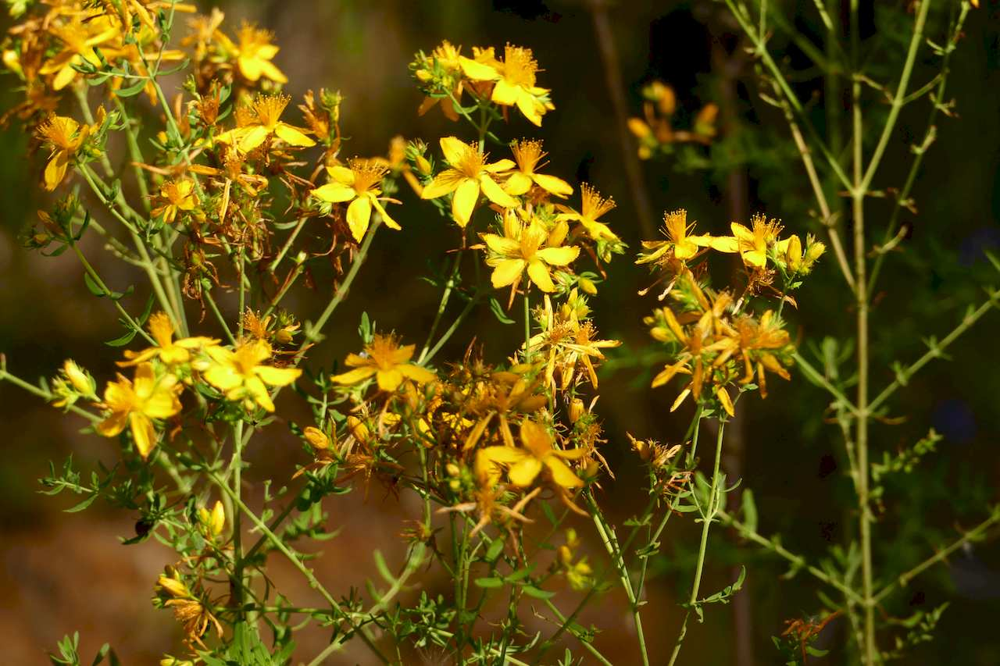
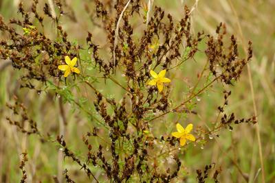
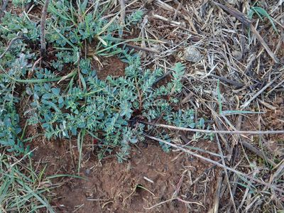

## Clusiaceae
# Hypericum perforatum
 **Plant Form** Perennial woody to fleshy herb. **Size** Usually 30-70 cm tall, but can reach 1.2 m. **Stem** Flowering stems upright and woody, non-flowering stems form tangled thickets **Leaves** Opposite pairs on stem, spotted with oil glands clearly visible when held up to light. **Flowers** Star shaped 1-2 cm diameter, bright yellow with 5 petals, **Fruit and Seeds** Sticky 3 cell capsules with numerous tiny golden brown seeds. **Habitat** Roadsides, farmland, grasslands, riverbanks, railways. **Distinguishing Features** Distinct from other common species. Native hypericum are smaller and with more orange flowers.

 *Flowers are golden yellow* 

 *Seedpods are brown* 

 *Infested areas are light brown* 

 *Overwinters as a prostrate herb* 

