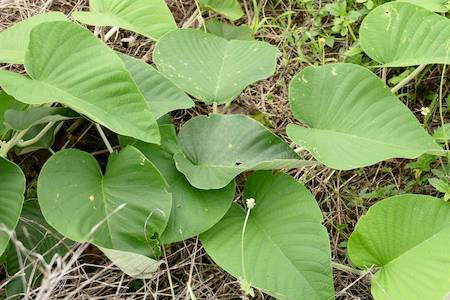
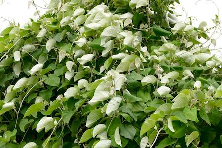

## Convolvulaceae
# Argyreia nervosa
**common names:** elephant ear vine

**Plant Form** Woody climbing vine. **Size** Upwards of 10 m high.

   *Leaves* 

   *Leaves are white below* 

   *Smothers trees* 

   *Woody seed pods* 

