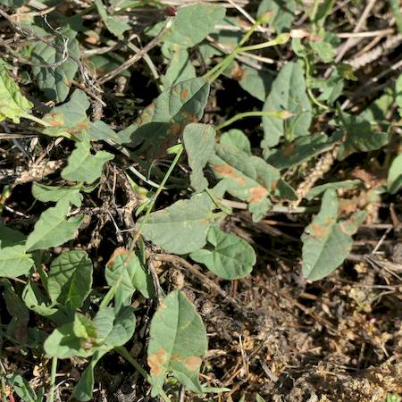

## Convolvulaceae
# Convolvulus arvensis
**common names:** field bindweed

**Plant Form** Creeping, sometimes climbing perennial herb. **Size** 50cm to 2m high. **Stem** Slender, narrowly winged and nearly hairless, form dense mats. **Leaves** Alternately arranged, 1.5-6 cm long, variable but often oblong or arrowhead shaped. **Flowers** Five fused white to pink petals, in clusters of 2 to 4, only open for one day and close in dull weather. **Fruit and Seeds** Hairless capsules, spherical, browning when mature, with 2-4 rough or warty seeds. **Habitat** Roadsides, rail lines, neglected urban areas. **Distinguishing Features** Larger flowers than native Bindweeds, flower does not have bracts like Greater bindweed.

   *Flower* 

   *Leaves* 

   *Rambles over ground* 

