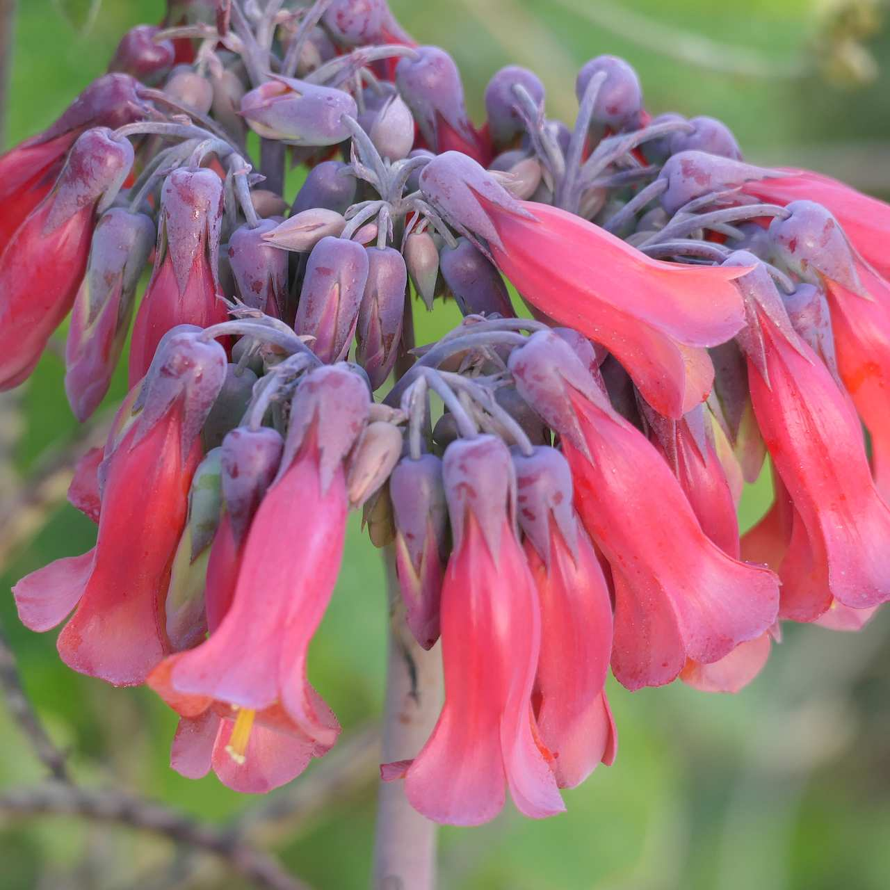
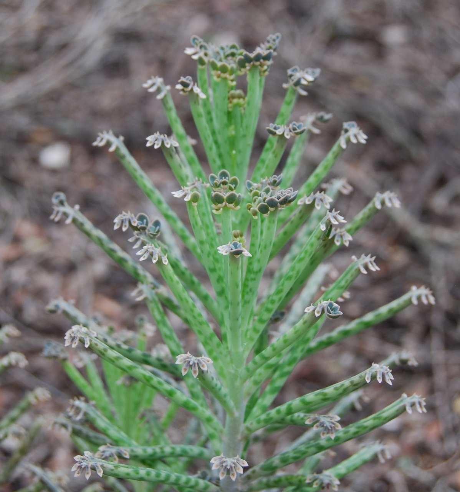
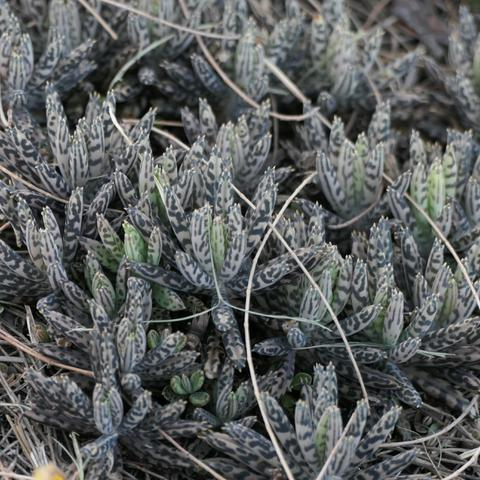

## Crassulaceae
# Bryophyllum delagoense
 **Plant Form** Succulent perennial herb. **Size** Usually 30-180 cm tall. **Stem** Hairless, mostly unbranched, greyish to pinkish-grey. **Leaves** Near cylindrical shape, greyish, 1.5 to 15 cm long, sometimes with darker mottling, fleshy, with tooth like edges near the tips. **Flowers** Bell-shaped, tubular drooping 2-4 cm long, bright red, orange or pinkish, with 4 fused petals. In tightly branched clusters at the top of stems. **Fruit and Seeds** Dry, papery, about 1 cm long, enclosed in old flower parts, deeply divided into 4 sections, with minute brown seeds. **Habitat** Pastures, grasslands, open woodlands, coastal headlands, dunes, fencelines, old gardens. **Distinguishing Features** Distinguished from other Bryophyllum by shape of leaves.

 *Flowers* 

 *Plantlets at tips of leaves* 

 *Mottled grey leaves* 

