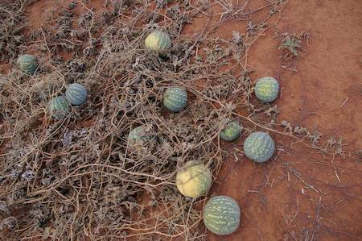

## Cucurbitaceae
# Citrullus lanatus
 **Plant Form** Speading herb. **Size** Low, with sprawling stems up to 3m long. **Stem** Covered with soft hairs, wooly towards tip, with branched tendrils. **Leaves** Alternate on stems, oval to heart shaped with deep lobes, often variegated. **Flowers** Singular on stalks, yellow, to 4 cm diameter, with 5 petals radiating from base, hairy or wooly. **Fruit and Seeds** Green, fleshy melon, mottled with white or light green, smooth, round to slightly oblong. **Habitat** Pastures, agricultural areas, floodplains, riverbanks, dry lake beds. **Distinguishing Features** Deeply lobed and variegated leaves.

 *Melon and leaves* 

 *Melon and vine* 

 *Melons and withered vine* 

