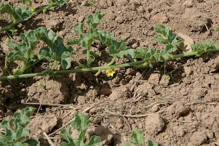

## Cucurbitaceae
# Cucumis myriocarpus
 **Plant Form** Creeping annual herb. **Size** Up to 2 m tall. **Stem** Cylindrical, rough, green. **Leaves** Alternating along stem, up to 8 cm long and wide, nearly hairless upper, hairy to bristly below, deeply lobed. **Flowers** Small, yellow, inconspicuous to 6 mm diameter, in clusters of 2-4. **Fruit and Seeds** Green to yellow elliptical melon, occasionally striped or mottled, with soft and often hooked spines. **Habitat** Grassy areas, open woodlands, roadsides, streams. **Distinguishing Features** Elliptical fruit and cylindrical stems.

 *Small spiny fruit* 

 *Leaves and Flower* 

 *Growth form* 

