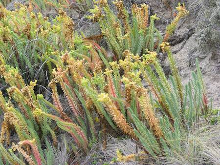

## Euphorbiaceae
# Euphorbia paralias
**common names:** sea spurge

**Plant Form** Erect perennial herb. **Size** Up to 1 m tall. **Stem** Upright, fleshy 2-5 cm thick,bluish green with milky sap. Die off after flowering. **Leaves** Small, oblong  to oval shaped, 5-30 mm long, thick and hairless, turn reddish with age. Densely overlapping on stem. **Flowers** Tiny, yellowish green, crescent shaped in small cup-shaped organs. Clustered at the tip of branches. **Fruit and Seeds** Capsule 3-5 mm long with three egg shaped seeds, in large green stalked ovary. **Habitat** Dunes, beaches, estuaries, coastal grasslands and herbfields. **Distinguishing Features** Can look similar to other spurges, but distinguished by growing location and somewhat fleshy leaves.

  
 *Thin plants with round flowers* 

  
 *Infestation on a beach* 

  
 *On a seawall* 

