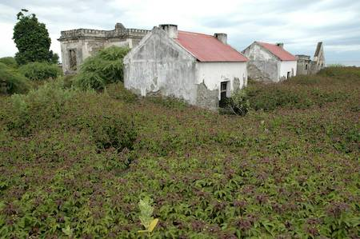
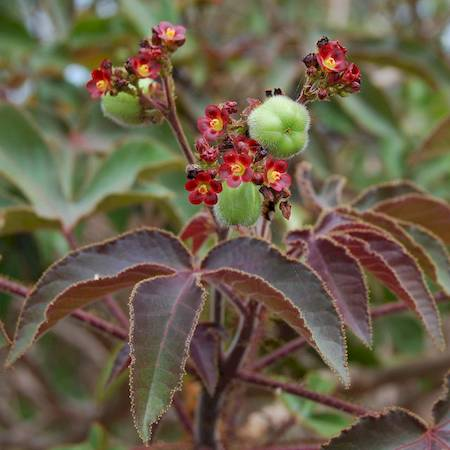

## Euphorbiaceae
# Jatropha gossypiifolia
**common names:** bellyache bush

**Plant Form** Erect deciduous shrub or tree. **Size** Up to 4 m tall. **Stem** Young stems are purplish and hairy, older are softly woody, thick and succulent with a soapy sap. **Leaves** 10-15 cm long with 3 or 5 deep lobes, and on long stalks. Purplish with sticky hairs when young, turning green with age. **Flowers** Small and in loose branched clusters at the tip of stems 10-15 cm long. Purple to red with 5 petals. **Fruit and Seeds** Three lobed hairy oval or oblong capsules, green to brown as they mature. **Habitat** Drier tropical or subtropical areas, forests, waterways and disturbed areas. **Distinguishing Features** Distinguished from Physic Nut and Castor Oil plant by sticky hairs on young stems and leaves.

 *New growth usually red* 

 *Infestations usually reddish* 

 *green form also occurs* 

 *leaf stalks have round-tipped hairs* 

 *Flowers and fruit* 

 *Stems are thick* 

