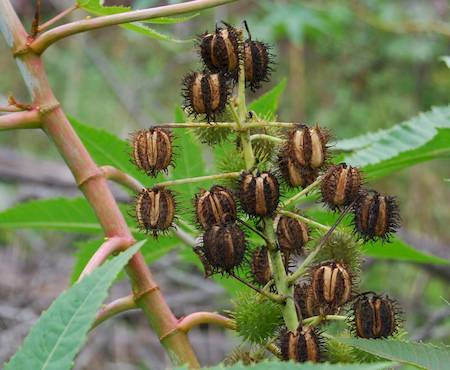

## Euphorbiaceae
# Ricinus communis
**common names:** castor oil plant

**Plant Form** Perennial large shrub. **Size** Usually 3 m tall but occasionally reaching 10 m. **Stem** Stout, hollow, dull pale green or red. **Leaves** Large 10-40 cm diameter, star shaped with toothed edges, dark red-brown or green-blue, on stalks 10-30 cm long. **Flowers** Red or creamy yellow without petals, clustered at end of stems. Present year round. **Fruit and Seeds** Spherical 1-3 cm diameter, with red or green soft spines. Seeds are smooth shiny grey or whitish 1.5 cm long. **Habitat** Watercourses, floodplains, neglected areas, roadsides. **Distinguishing Features** May resemble Bellyache Bush, but much larger, not hairy, and with spiny fruit.

  
 *Habit* 

  
 *Seed pods* 

  
 *Fruit* 

  
 *Leaves* 

  
 *Flowers and new leaf* 

