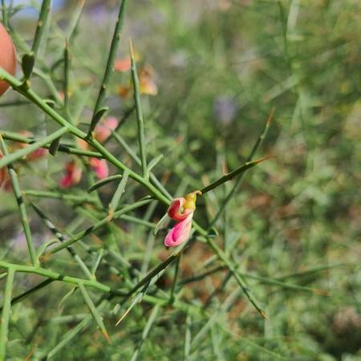
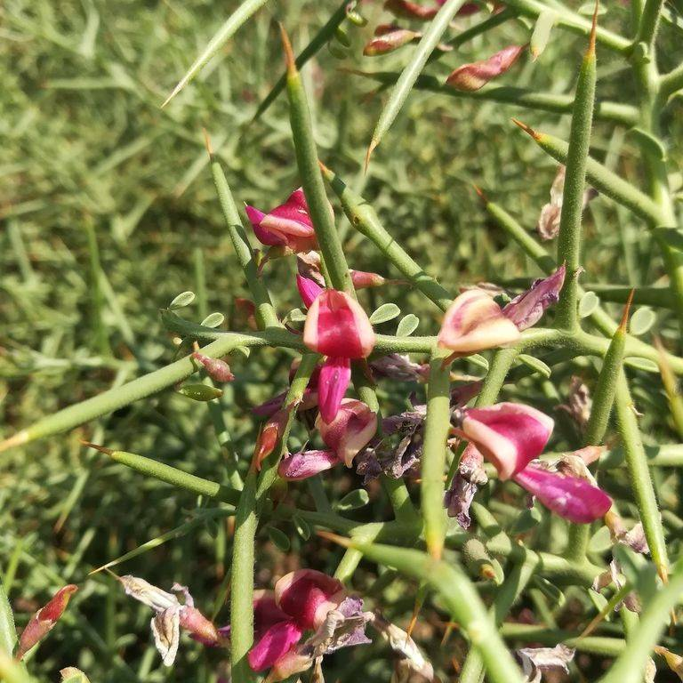
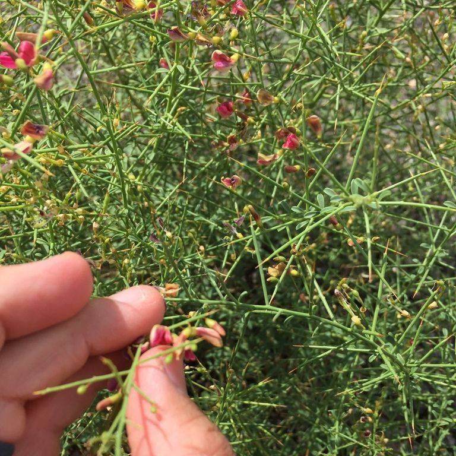
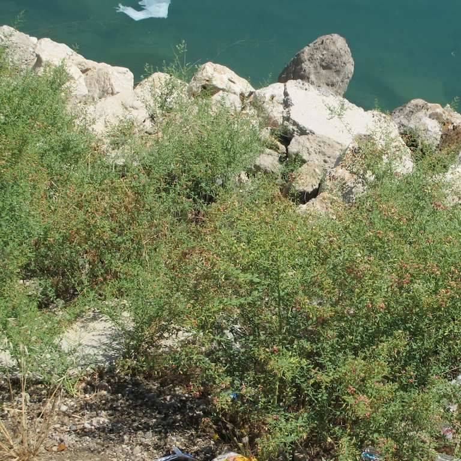

## Fabaceae
# Alhagi maurorum
**common names:** camel thorn

**Plant Form** Stiff perennial shrub. **Size** Up to 1.5 m tall. **Stem** Erect, mostly hairless, finely ribbed, pale greyish-green. **Leaves** Bluish green up to 3 cm long, somewhat succulent, at base of spike-tipped side branches. **Flowers** Small purplish-red and yellow pea flowers, arising from auxillary spines in groups of 1-6. **Fruit and Seeds** Seed pods up to 3 cm long and narrow with a small beak at tip, containing usually 1-5 small kidney shaped seeds. **Habitat** Drainage lines, dried creekbeds, arid areas with good subsurface moisture. **Distinguishing Features** No known close lookalikes.

   *Long spines and red pea flowers* 

   *Reduced leaves* 

   *Foliage is fine and dense* 

   *Bushy growth form* 

