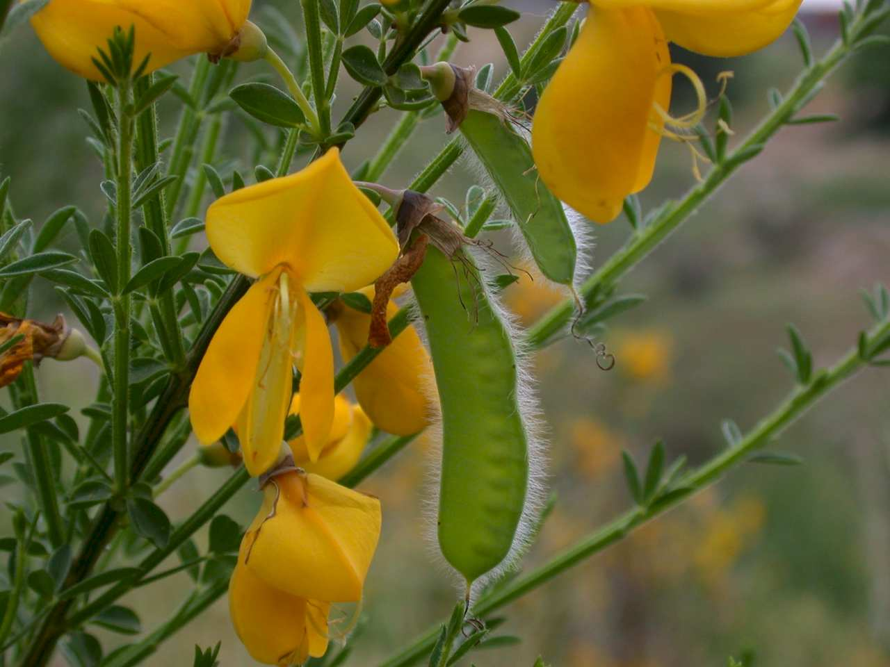
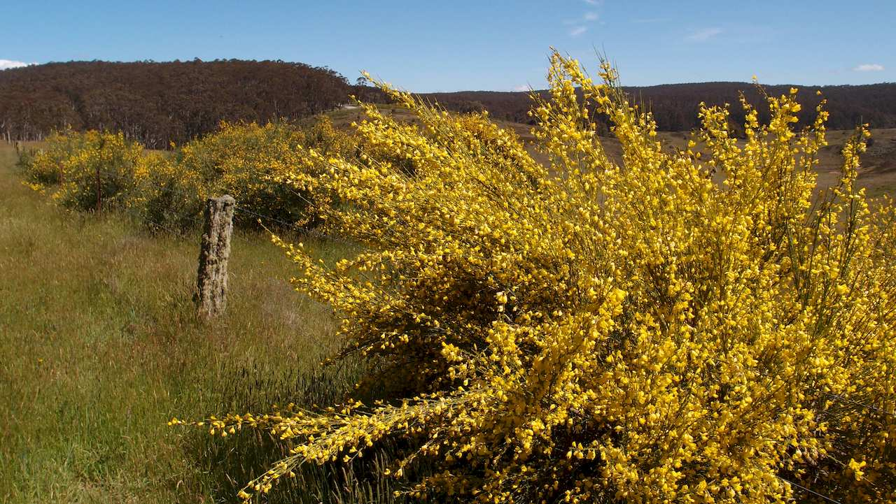
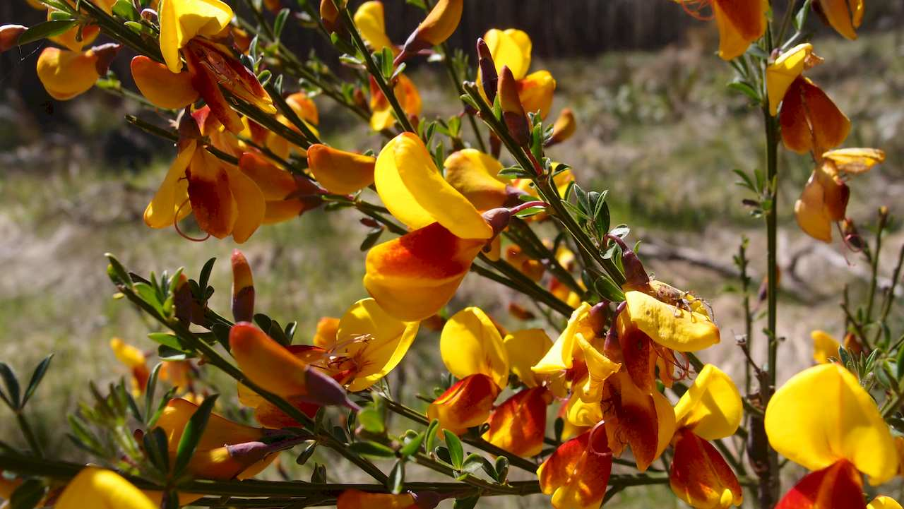

## Fabaceae
# Cytisus scoparius

**Plant Form** Erect multi-stemmed shrub. **Size** Up to 4 m tall. **Stem** Numerous with pronounced ridges, sometimes woody. **Leaves** Small opposite narrow leaves or absent. **Flowers** Yellow pea-like, 2 cm long, singular or in pairs, can appear dense. **Fruit and Seeds** Brown to black pea-like pods up to 7 cm long. Containing 5-22 yellowish brown to olive seeds. **Habitat** Typically river banks, forest margins and roadside areas. Many suitable habitats. Typically areas over 500 mm of rain. **Distinguishing Features** Stem ridges and small or absent leaves help distinguish from other brooms.

 *Flowers and immature pod* 

 *Growth habit* 

 *Reddish flowers* 

