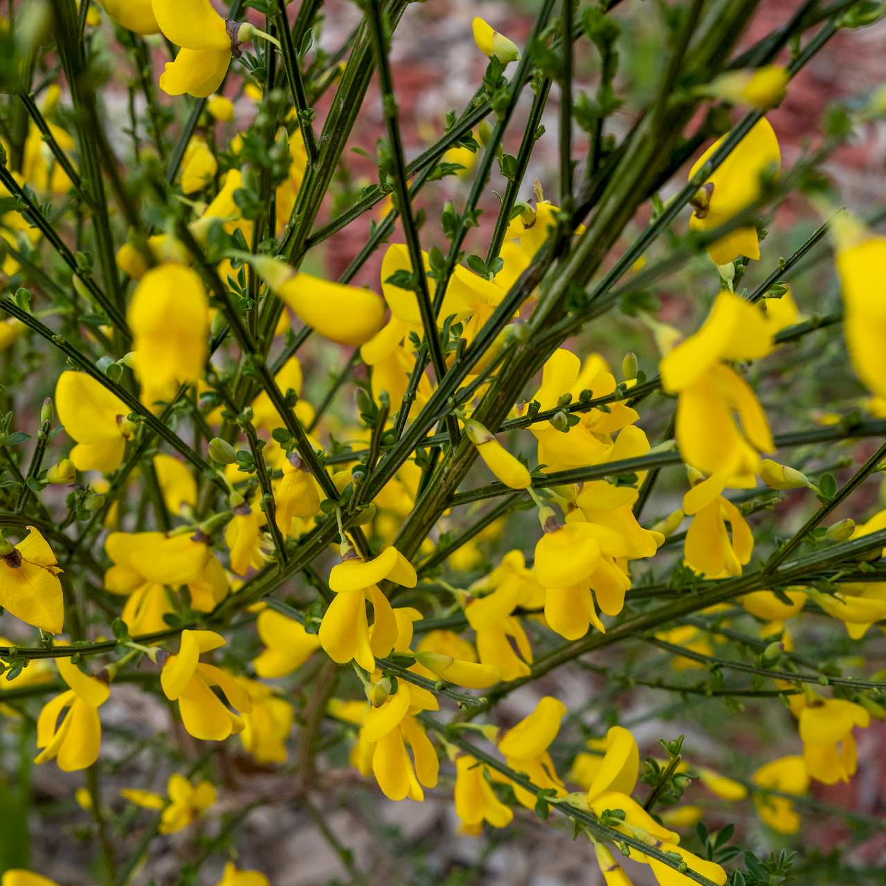
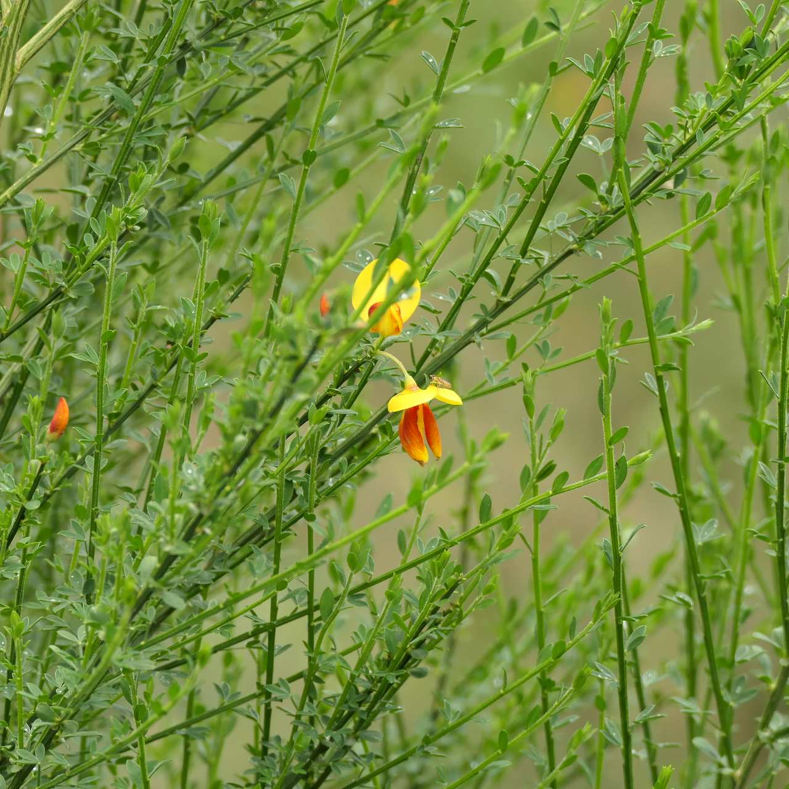
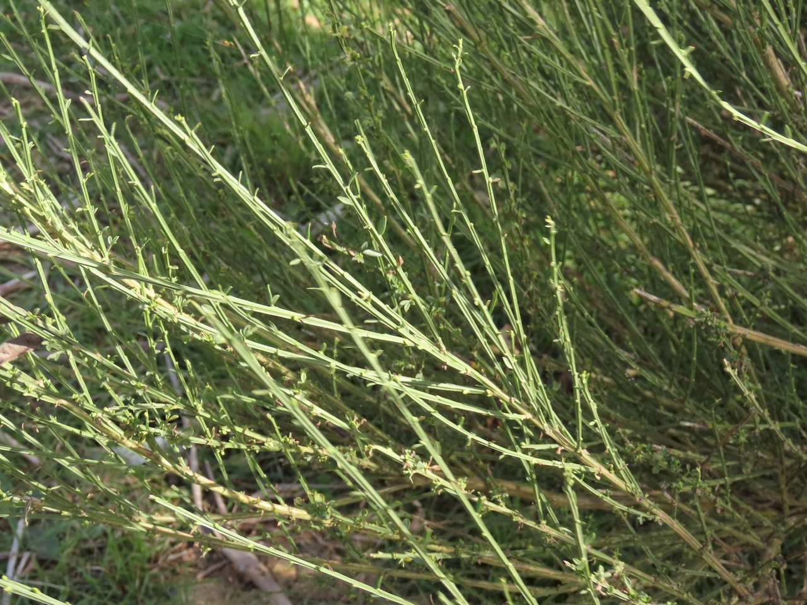
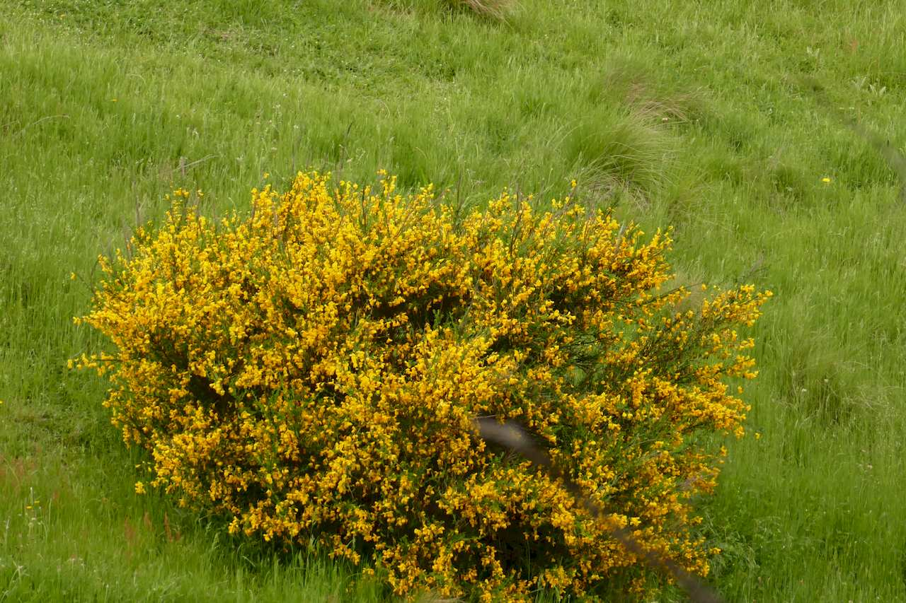

## Fabaceae
# Cytisus scoparius subsp. scoparius
**common names:** Scotch broom

**Plant Form** Erect multi-stemmed shrub. **Size** Up to 4m tall.

  
 *Flowers* 

  
 *Has leaves in growing season* 

  
 *Stems more visible in droughts* 

  
 *Large bush* 

