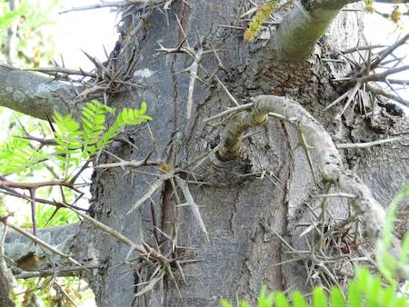

## Fabaceae
# Gleditsia triacanthos
**common names:** honey locust

**Plant Form** Large deciduous tree. **Size** Up to 30m tall.

 *Twigs have long spines* 

 *Ferny leaves, wattle-like flowers* 

 *Spines on trunk* 

