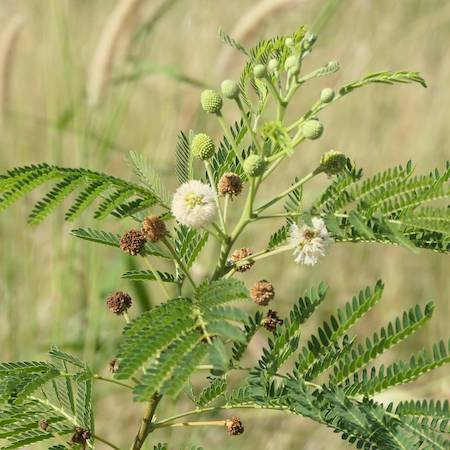
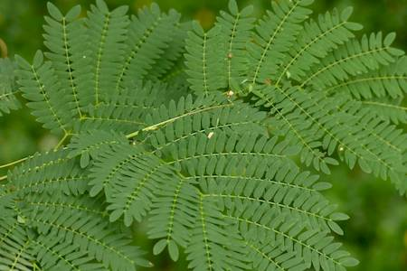

## Fabaceae
# Leucaena leucocephala
**common names:** leucaena

**Plant Form** Shrub or small tree. **Size** Usually 2-10 m tall, occasionally taller. **Stem** Green and covered in fine hairs when young, turning smooth, grey and somewhat pimply with age. **Leaves** Compound of opposite leaves which are themselves a compound of leaflets. Bright green oval shaped up to 35 cm long. **Flowers** Dense globular clusters 12-30 mm across, on stalks, greenish with many whitish stamens giving overall yellowish white appearance. **Fruit and Seeds** Elongated, large, flattened green to reddish-brown pods 8-22 cm long, with pointed tip. **Habitat** Waterways, roadsides, woodlands, parks, waste areas, coastal foreshores. **Distinguishing Features** Distinct, but subspecies are distinguished by size.

  
 *Large brown pods* 

  
 *Flower* 

  
 *Often as thickets* 

  
 *Old trees covered in pods* 

  
 *Bipinnate leaves* 

