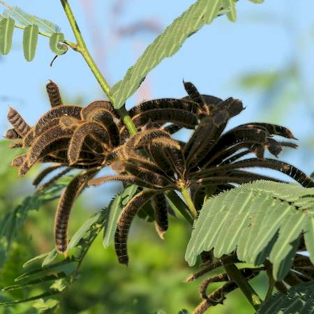
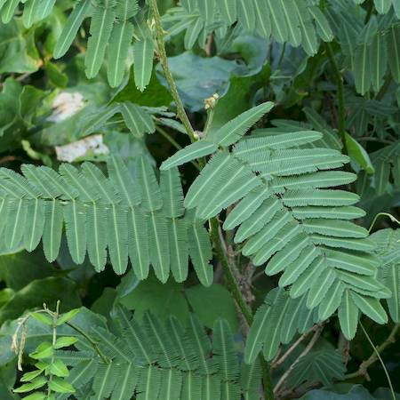
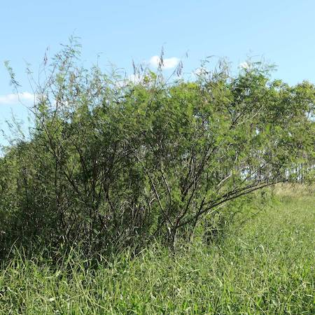
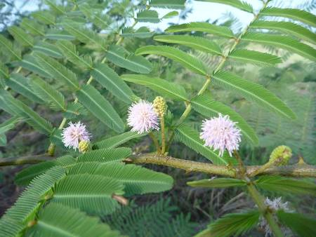

## Fabaceae
# Mimosa pigra
**common names:** mimosa

**Plant Form** Upright thicket-forming shrub. **Size** 3-6 m tall. **Stem** Green when young maturing to woody, with curved prickles 5-10 mm long. **Leaves** Bright green 20-30 cm long alternating along stem, divided into opposite pairs of leaflets, which are further divided into 20-45 tiny pairs of leaflets. Leaves close when touched.. **Flowers** Pink or mauve, 1-2 cm diameter, pom-pom shaped. **Fruit and Seeds** Flattened pods 3-15 cm long, olive green to brown, hairy. Seeds in 14-26 individual segments which break off with age. **Habitat** Floodplains, riverbanks, seasonal wetlands, roadsides, drains, grazing land. **Distinguishing Features** Sensitive leaves which close when touched. Has longer prickles and seed pods than other mimosas which also have the sensitive leaves.

   *Seed pods are hairy* 

   *Compound leaves taper* 

   *Forms large bushes* 

   *Flowers* 

