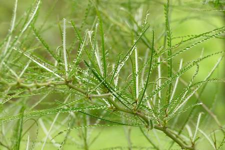

## Fabaceae
# Parkinsonia aculeata
**common names:** parkinsonia

**Plant Form** Upright thicket-forming shrub or small tree. **Size** 2-6 m tall. **Stem** Slender, drooping and tend to zig-zag. With thorns 5-20 mm long. **Leaves** Flat green stalk up to 30 cm long with small green leaflets along both sides. **Flowers** Bright yellow, fragrant 1-2 cm wide, in loose bundles on long stalks near branch ends. **Fruit and Seeds** Pencil-like pods 5-10 cm long with constrictions between seeds. **Habitat** Floodplains, river banks, pastures, roadsides, woodland. **Distinguishing Features** Flattened leaf stalk with leaflets is distinctive.

  
 *Foliage with leaflets* 

  
 *Flowers* 

  
 *Green medium-sized stems* 

  
 *Leaflets fall during dry* 

  
 *Spines on trunk, main branches* 

  
 *Growth habit* 

