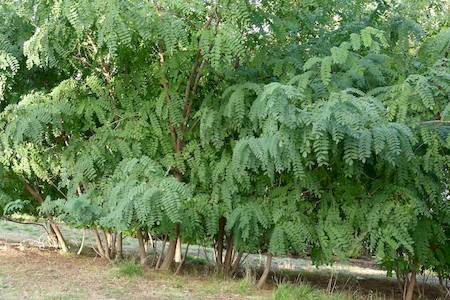

## Fabaceae
# Robinia pseudoacacia
**common names:** black locust

**Plant Form** Deciduous tree. **Size** Usually 10m tall, but up to 17m. **Stem** Reddish grey with spines or thorns on stems and branches. Trunk woody and becoming deeply fissured with age. **Leaves** 8-15 cm long in 5-10 pairs of oval to egg shaped leaflets. **Flowers** Hanging groups of white, pink or purplish pea shaped flowers with green or yellow markings in centre. **Fruit and Seeds** Brown, woody, hanging flattened pods 3-8 cm long without hairs. Containing 4-10 blackish seeds 5 mm long. **Habitat** River flats, grassland, woodland, abandoned gardens, roadsides. **Distinguishing Features** Similar to Honey Locust, but with different flowers, more leaflets and paired spines.

 *Flowers* 

 *Foliage* 

 *Spines* 

 *Grove of suckers* 

