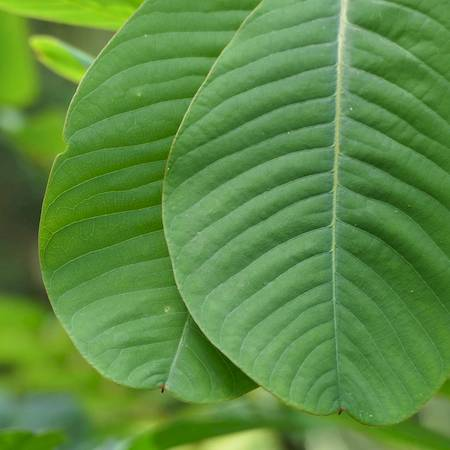

## Fabaceae
# Senna alata

**Plant Form** Large spreading shrub. **Size** 2-4 m tall. **Stem** Thick, pithy, upright, branching, woody with age. **Leaves** Large 15-40 cm long, compoint of 8-12 opposite pairs of leaflets, oblong and veiny with smooth edges. **Flowers** Golden yellow, in 30-60 cm long clusters of 20-40 **Fruit and Seeds** Straight or curved cylindrical, 12-16 cm long with wings along length, with numerous flat seeds. **Habitat** Creek lines, roadsides, drainage channels. **Distinguishing Features** Generally has more pairs of leaflets than other Senna species.

  
 *flowers* 

  
 *leaflets* 

  
 *Seed pods* 

  
 *Infestation in drain* 

