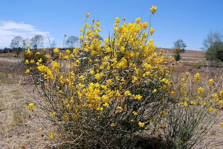

## Fabaceae
# Spartium junceum

**Plant Form** Erect evergreen many-stemmed shrub. **Size** Up to 3m tall. **Stem** Rush like, thin, straight, often leafless. **Leaves** Small, single, oval to oblong, often absent. **Flowers** Typical yellow pea like about 2 cm long in groups of 5-15. **Fruit and Seeds** Typical broom pods, brown to yellowish brown 5-10 cm long flattened, with fine hairs when immature. **Habitat** Roadsides, railway lines, urban bushland, creeks. **Distinguishing Features** Stems are smooth and round as opposed to ribbed in English broom.

   *Flowers* 

   *Pods* 

   *Stems* 

   *Growth form* 

