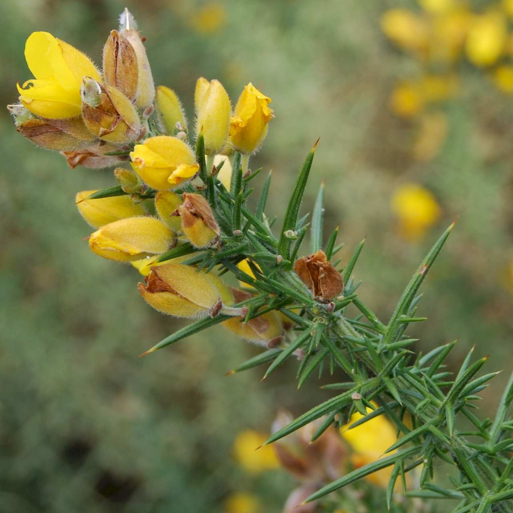
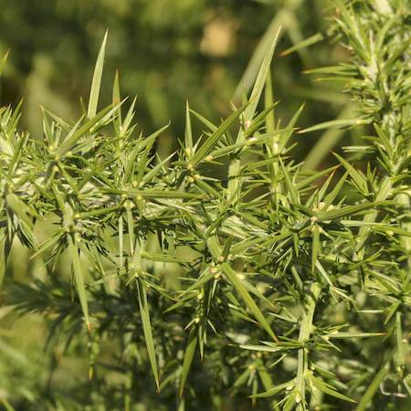
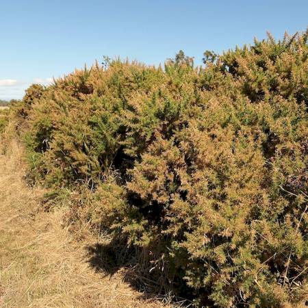
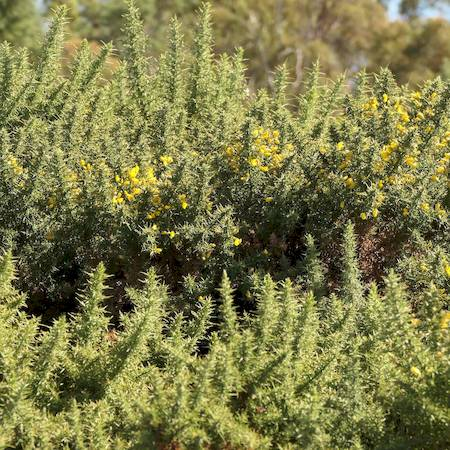

## Fabaceae
# Ulex europaeus
**common names:** gorse

**Plant Form** Woody spiny shrub. **Size** Up to 4 m tall. **Stem** Erect, soft to rough and woody developing fissures as matures. **Leaves** Alternate to spirally aranged, very spiny with waxy coating, 6-30 mm long. **Flowers** Bright yellow pea like 15-25 mm long. **Fruit and Seeds** Oblong, greyish pods 10-20 mm long covered in fine hairs. **Habitat** Roadsides, creek banks, bushland, disturbed areas. **Distinguishing Features** Combination of shape, spikiness and flowers make it distinctive.

  
 *Flowers* 

  
 *Foliage close-up* 

  
 *Habit* 

  
 *Foliage* 

