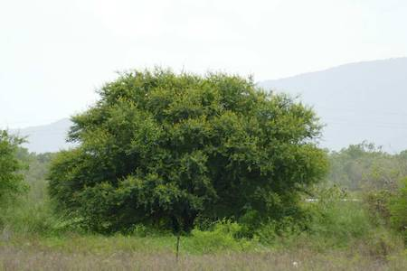
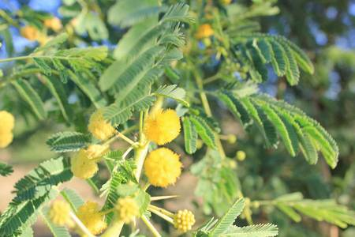

## Fabaceae
# Vachellia nilotica
 **Plant Form** Large spreading multi-stemmed shrub or small tree. **Size** Up to 14 m tall. **Stem** Single stem, young bark has tinges of orange or green with 1-5 cm long spines, older trees have rough bark and lose thorns. **Leaves** 3-4 cm long comprising 10-25 pairs of very small leaflets along length. **Flowers** Globular wattle-like yellow flowerheads about 10 mm diameter, in groups of 2-6. **Fruit and Seeds** Grey-green pods 10-20 cm long, covered in fine hairs and with constrictions between seeds. **Habitat** Rangelands, pastures, around waterways and floodplains. **Distinguishing Features** Pods are strongly constricted, having an almost pearl necklace appearance.

 *Immature pods* 

 *Leaves and spines* 

 *Habit, no cattle* 

 *High foliage is pendulus* 

 *Flowers are yellow* 

