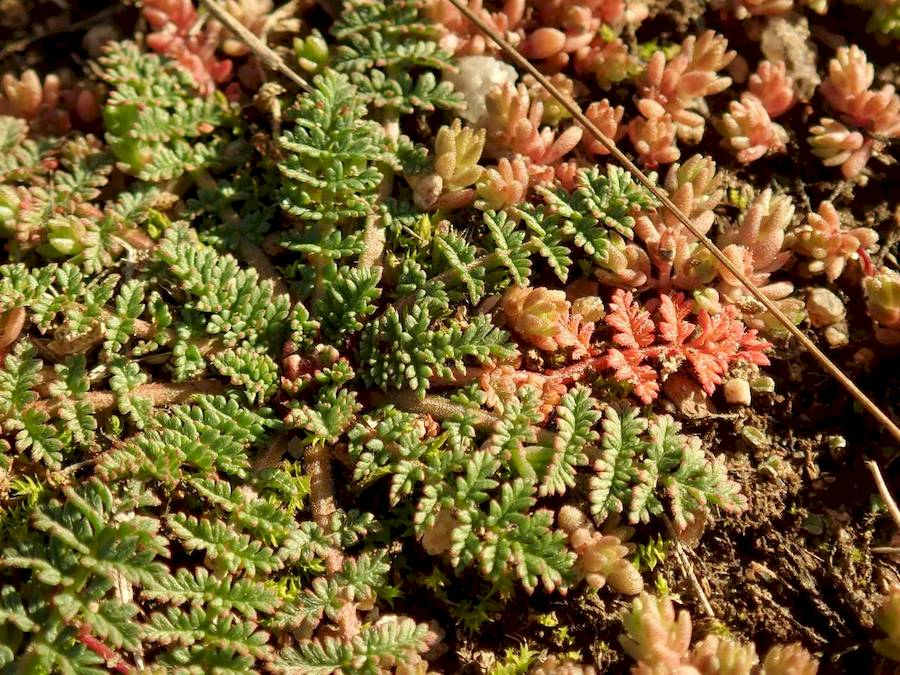
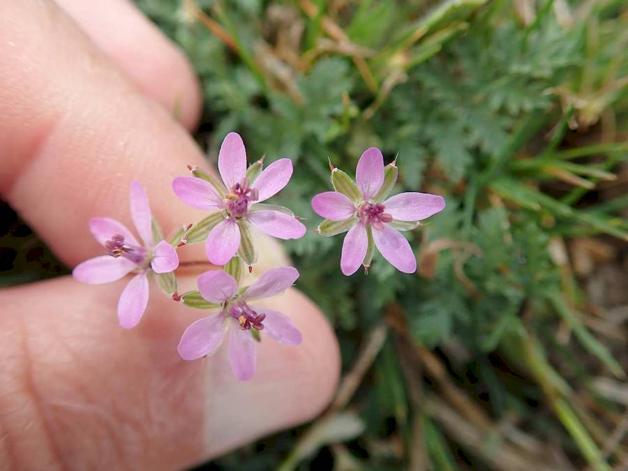
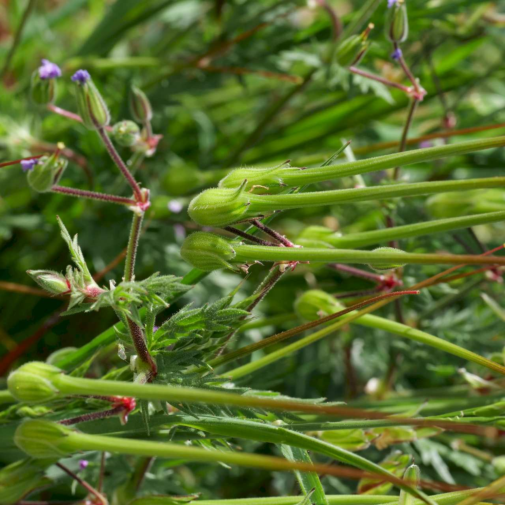

## Geraniaceae
# Erodium cicutarium

**Plant Form** Spreading to erect annual herb. **Size** Up to 40cm tall.

  
 *Fine leaves, reddish after frost* 

  
 *Pink flowers* 

  
 *Typical Erodium fruits* 

