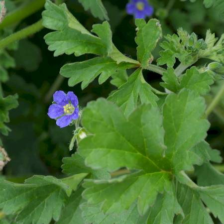
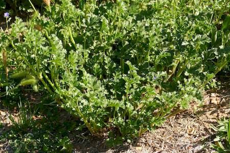
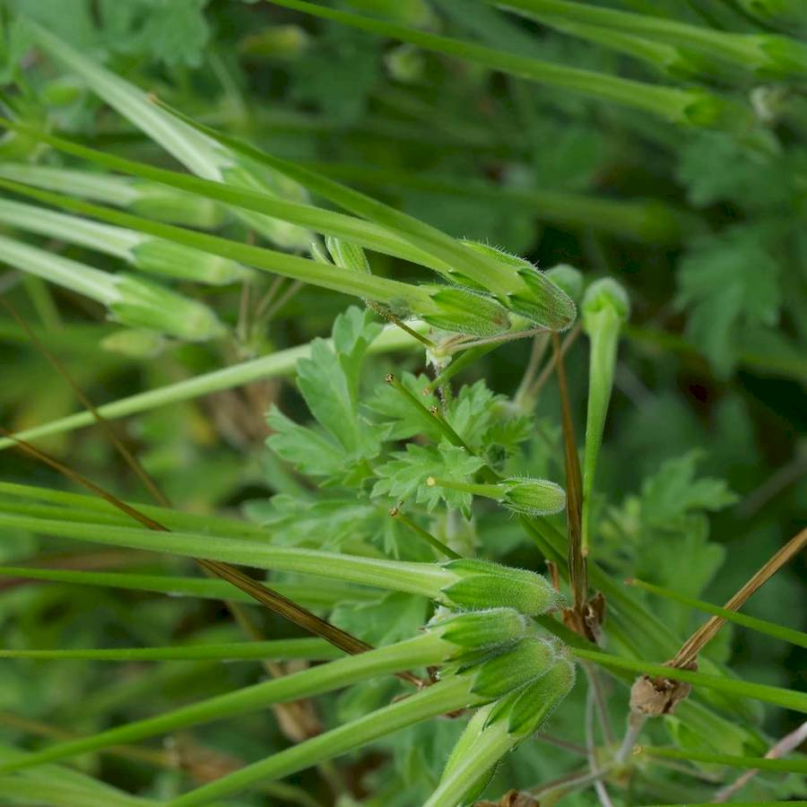

## Geraniaceae
# Erodium crinitum

**Plant Form** Spreading to erect annual herb. **Size** Up to 50cm tall.

   *Blue flowers, large leaves* 

   *Tall and bushy for Erodium* 

   *Typical Erodium seeds* 

