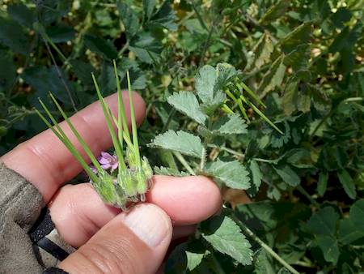

## Geraniaceae
# Erodium moschatum

**Plant Form** Spreading to erect annual herb. **Size** Up to 40cm tall.

  
 *Soft leaves arch up from ground* 

  
 *large leaflets, pink flowers* 

  
 *Typical Erodium fruit* 

