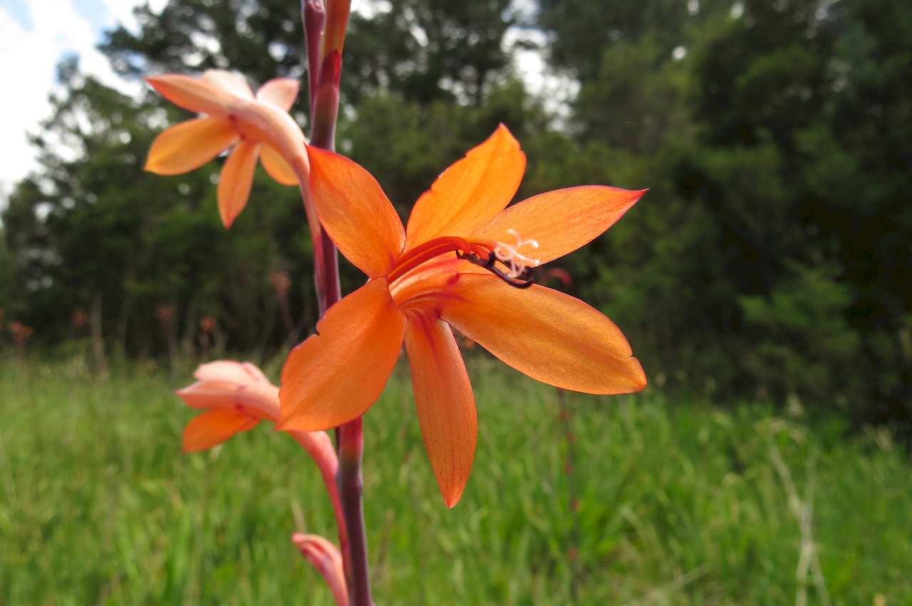
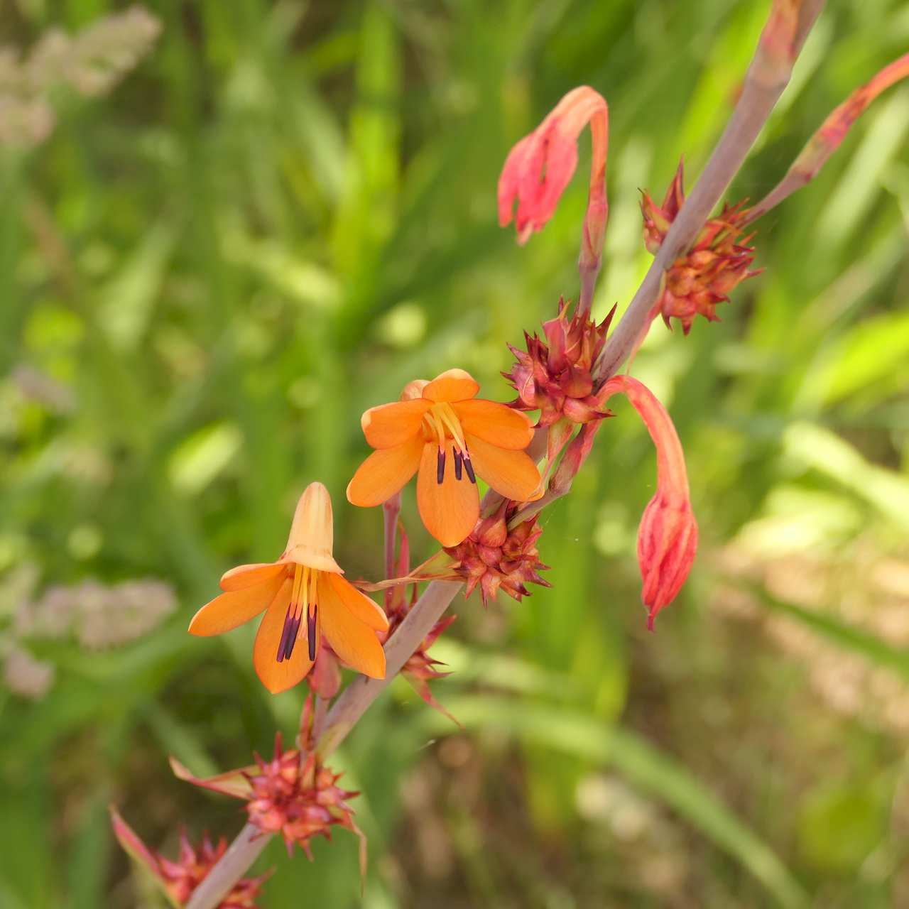
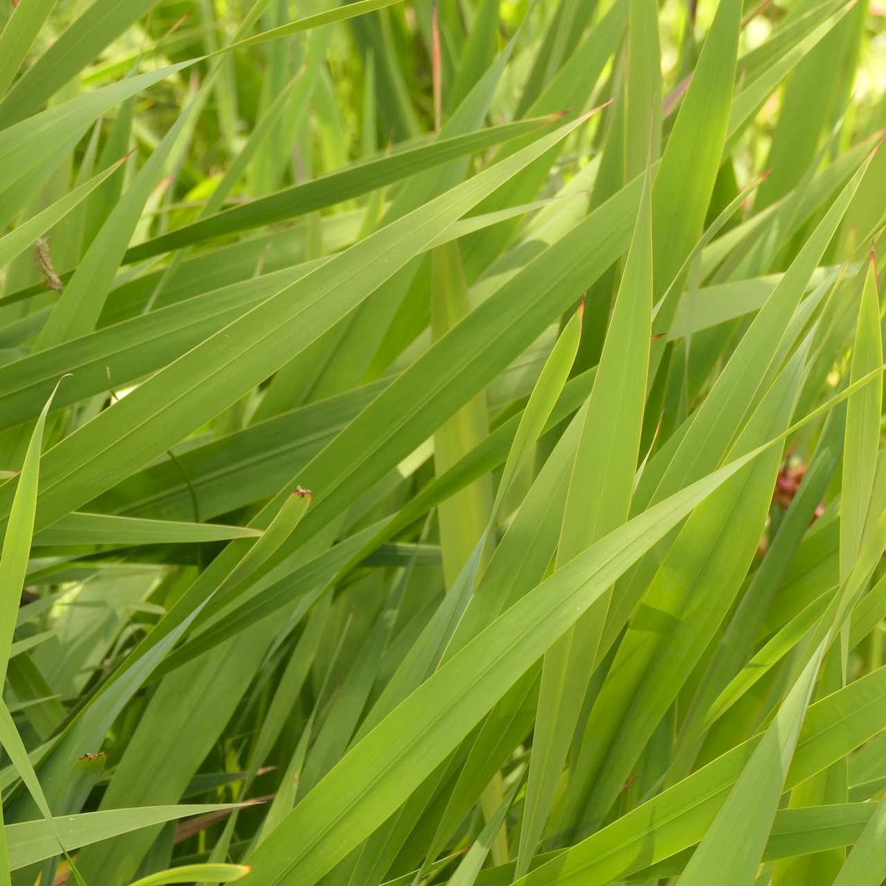
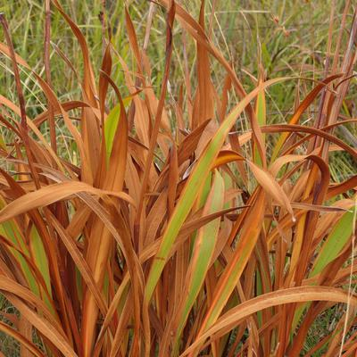
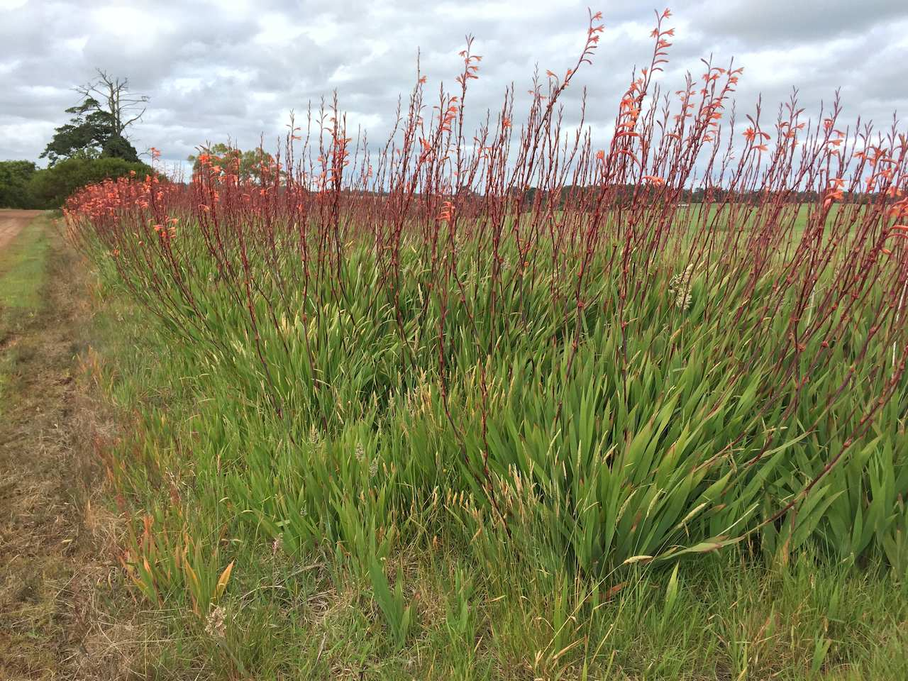

## Iridaceae
# Watsonia meriana var. bulbillifera
**common names:** bulbil watsonia

**Plant Form** Upright perennial herb. **Size** Up to 2 m tall. **Stem** Only narrow flowering stems. **Leaves** 20-80 cm long, blade shaped. Tough, fibrous, with prominent midrib. Emerge from ground in fan like shape. **Flowers** Curved, trumpet shaped, showy 5-8 cm wide. Usually orange but also red, pink or white. In opposite rows on flower stem. **Fruit and Seeds** Egg shaped woody capsule 2-4 cm long, with 3 openings. **Habitat** Roadsides, disturbed areas, grasslands, swamps, woodlands. **Distinguishing Features** Only lookalikes when flowers are present are cultivated garden hybrids.

   *Flower* 

   *Flowers* 

   *Leaves* 

   *Winter leaves* 

   *Habit* 

