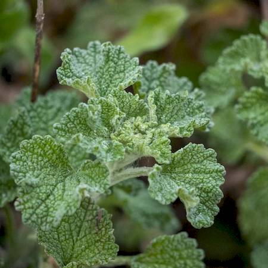
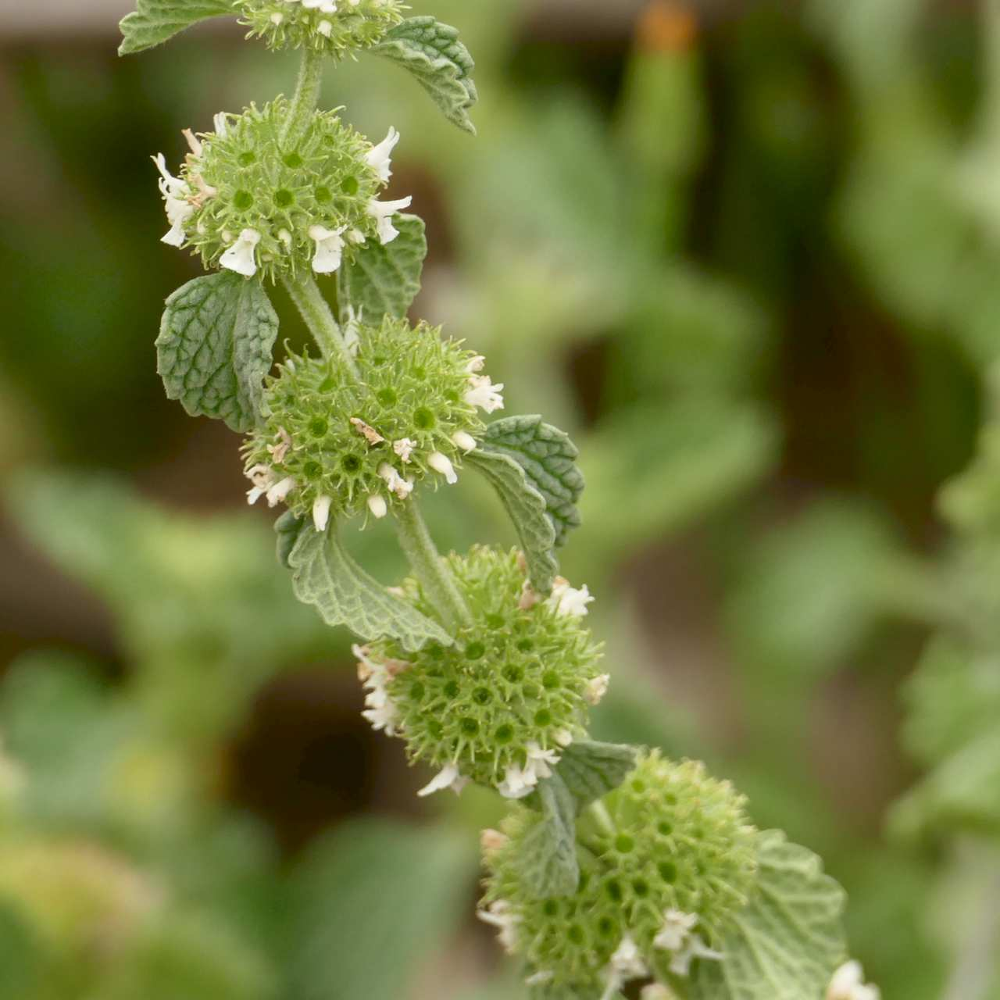
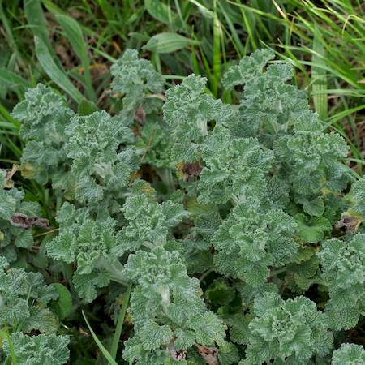
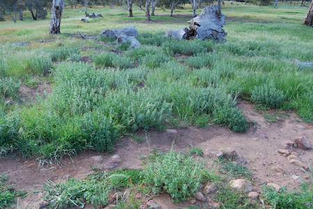

## Lamiaceae
# Marrubium vulgare
**common names:** horehound

**Plant Form** Upright or spreading perennial herb. **Size** Usually 12-60 cm tall but sometimes up to 1 m. **Stem** Densely covered in white hairs giving grey-white appearance. **Leaves** Round or oval shaped, in opposite pairs, hairy becoming less so with age, wrinkled with many indented veins, toothed edges. **Flowers** Densely clustered tubular white to cream forming a ball-like shape on stem. **Fruit and Seeds** In dry brown burr like structure after flowering. **Habitat** Degraded pastures, bare ground, disturbed bushland. **Distinguishing Features** Can be confused with mints and sages, but differs in overall combination of features.

 *Leaves have crumpled look* 

 *Flower are in round heads* 

 *Growth habit* 

 *Infestation* 

