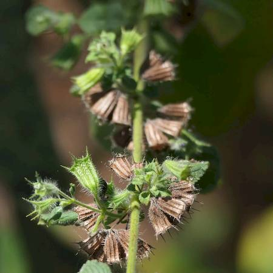
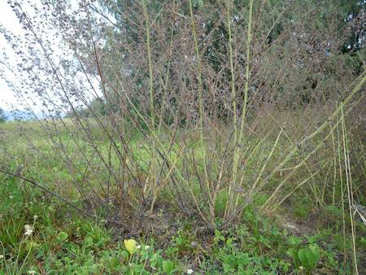

## Lamiaceae
# Mesosphaerum suaveolens
 **Plant Form** Upright annual or perennial herb. **Size** 1-3m tall. **Stem** Green or reddish green, very hairy, square. **Leaves** Opposite arranged, hairy, blade is egg shaped or oval shaped, possibly heart shaped. **Flowers** Pinkish or lavender blue tubular flowers, singly or in clusters of up to 5. **Fruit and Seeds** Lobed capsule that divides into 2 nutlets with a single seed each. Brown to black with whitish markings. **Habitat** Roadsides, pastures, stockyards, waterholes. **Distinguishing Features** As flowers die, distinctive tube remains.

 *Young leaves* 

 *Leaves are furry and smell* 

 *Flowers are small* 

 *Seed pods are bell-shaped* 

 *Isolated plants are V-shaped* 

 *Can form dense stands* 

