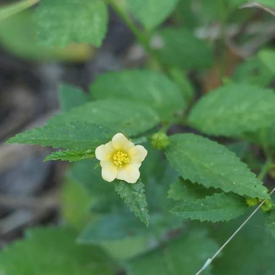
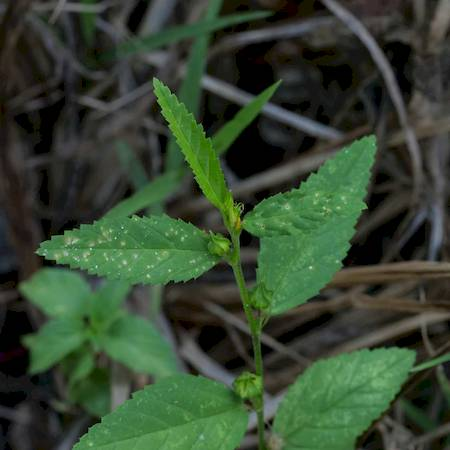
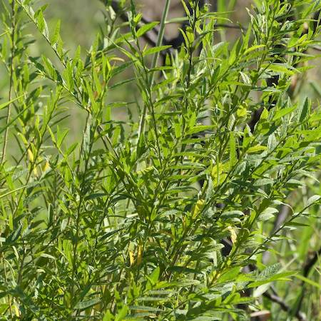

## Malvaceae
# Sida acuta
 **Plant Form** Perennial or annual herb or small shrub. **Size** 30 cm to 1.5 m tall. **Stem** Woody, branching several times, round, fibrous, covered in fine hairs. **Leaves** Lance shaped with serrated edges, alternately arranged on stem. **Flowers** Yellow, usually singular sometimes in pairs. **Fruit and Seeds** Hard structure that goes from green to brown as matures, sometimes in clusters, breaking apart into 8-10 wedge shaped seeds. **Habitat** Roadsides, pastures, rangelands, plantations, campsites. **Distinguishing Features** Very similar to other Sida species, distinguished from Malvastrum species by having an epicalyx (second layer of bracts below flower).

 *Flower* 

 *Leaves* 

 *Upright form* 

