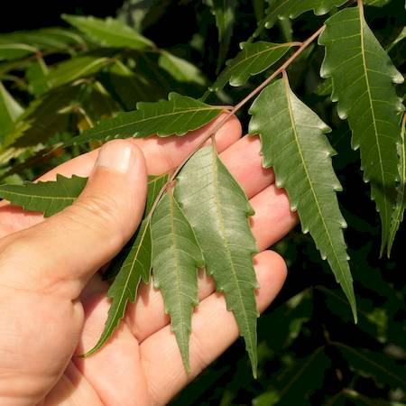

## Meliaceae
# Azadirachta indica
 **Plant Form** Small to medium tree. **Size** Usually up to 15 m but can grow up to 40 m tall. **Stem** Reddish brown, cracking and flaking trunk. **Leaves** Compound of 20-30 toothed leaflets giving jagged edged appearance. On opposite sides (pinnate). **Flowers** White flowers about 5 mm long, in drooping clusters. **Fruit and Seeds** Elongated,smooth, olive-like stone fruit to about 3 cm long. **Habitat** Seasonally dry tropical woodlands, roadsides, waterways. **Distinguishing Features** White flowers compared to purple or lilac of lookalike White cedar.

 *Leaflets* 

 *Compound leaves* 

 *Foliage* 

 *Bark - small stem* 

 *Flowers* 

 *Fruit* 

 *Trunk* 

