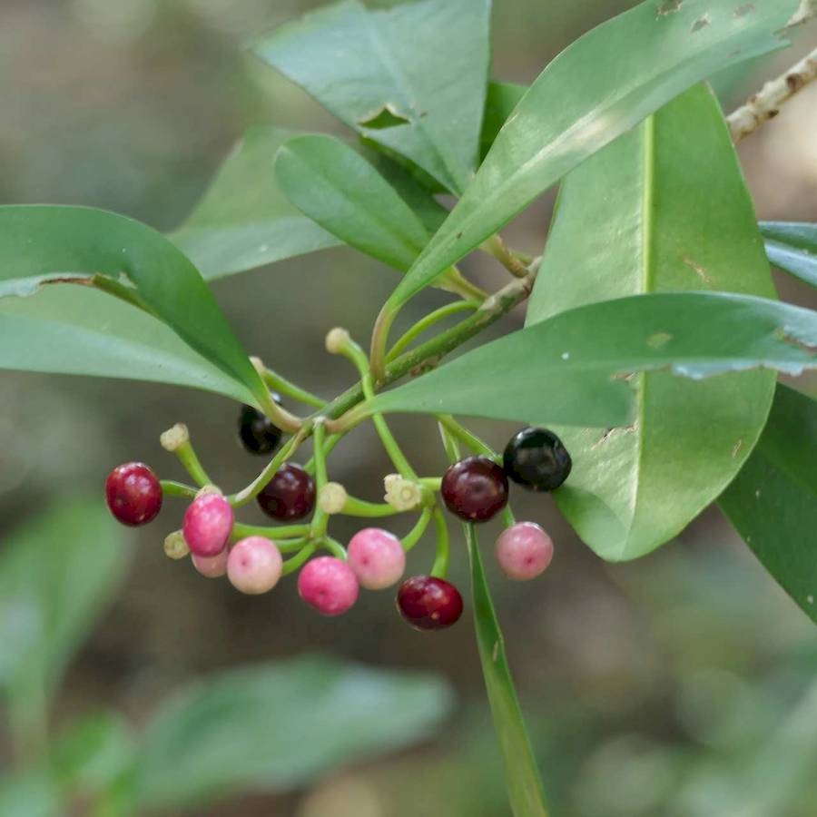
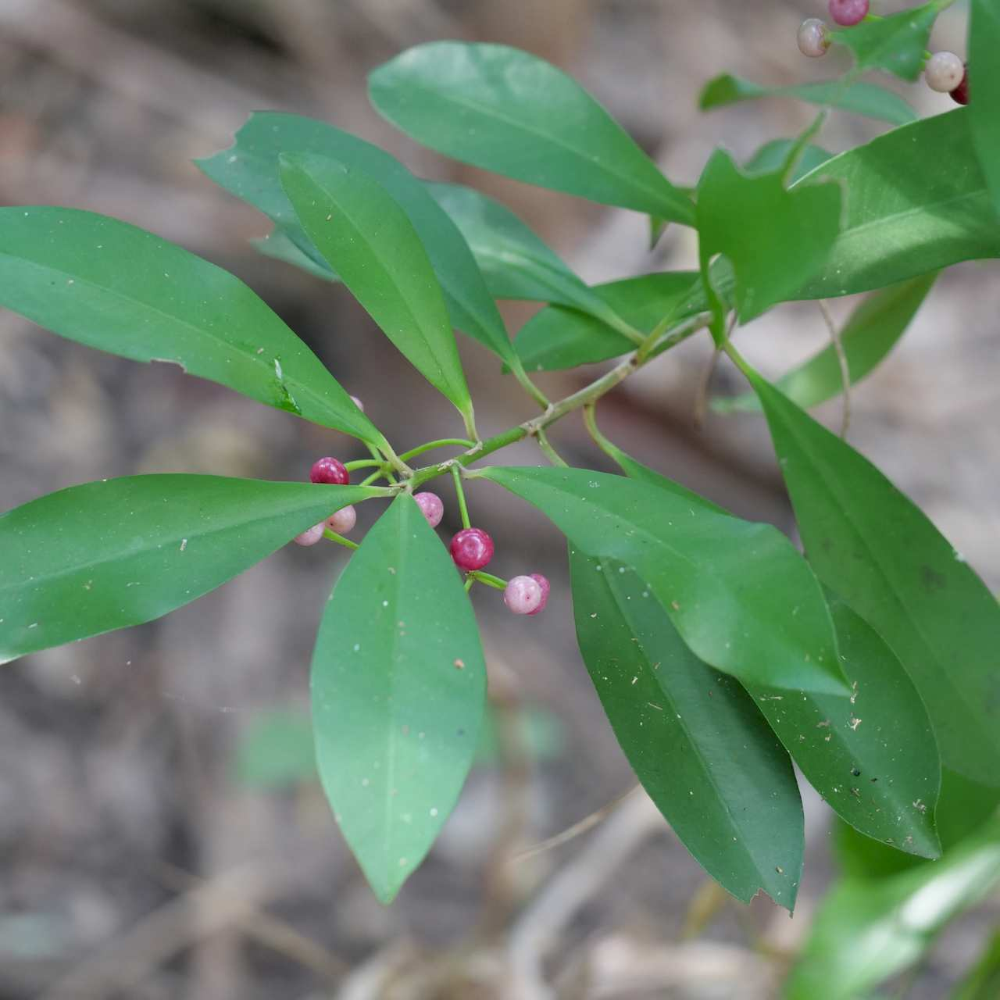
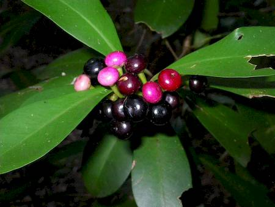
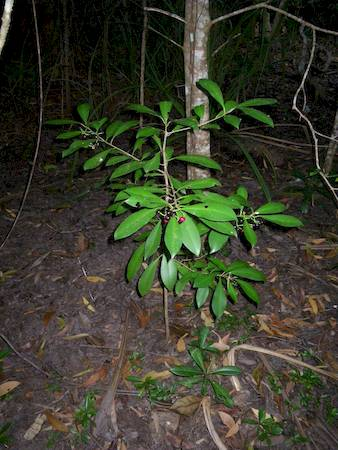

## Myrsinaceae
# Ardisia elliptica
**common names:** shoebutton ardisia

**Plant Form** Branching shrub or small tree. **Size** Up to 4 m tall. **Stem** Single main stem with short spreading branches. Younger branches prominently angled and hairless. Leaf stalks green or reddish. **Leaves** Elongated oval shaped, up to 20 cm long, leathery, with smooth edges, hairless and with pointed or rounded tips. **Flowers** Small, star shaped, with 5 pinkish petals. In clusters in upper leaf forks of main branches. **Fruit and Seeds** Bright red to blackish, fleshy, round and berry like, in clusters. Contain single round hard seed. **Habitat** Wet forests, riparian areas, disturbed sites. **Distinguishing Features** Smooth leaf edges differ from most other Ardisia.

   *immature fruit* 

   *foliage* 

   *ripe fruit are black* 

   *a small understorey plant* 

