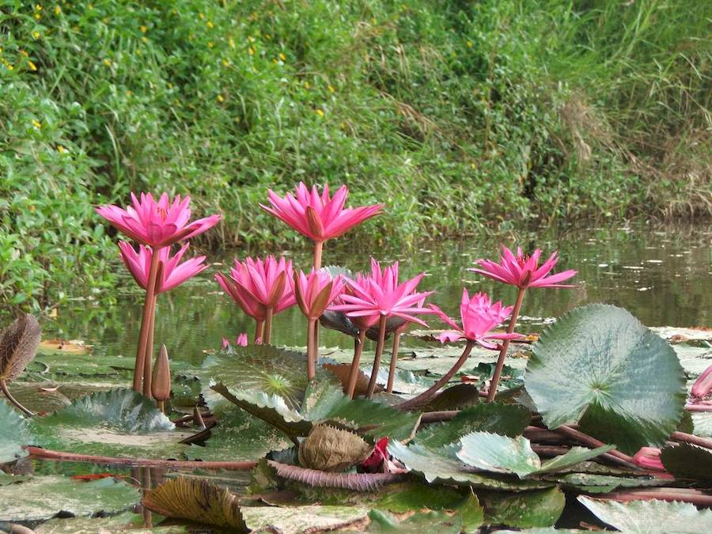
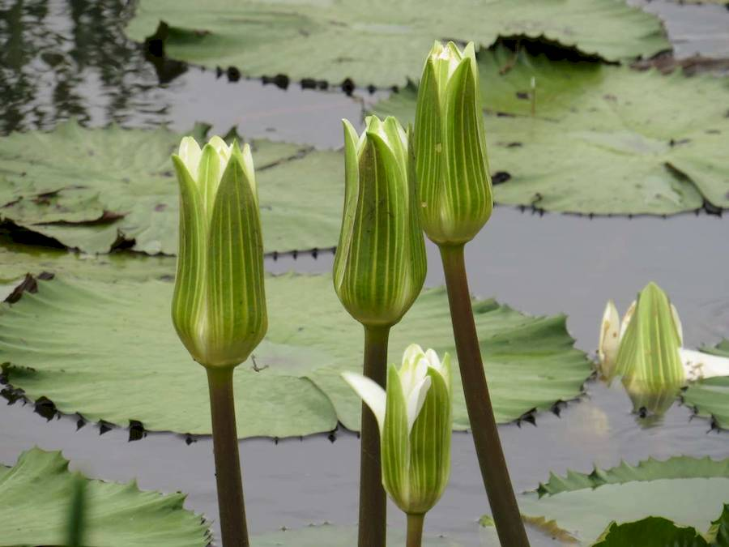
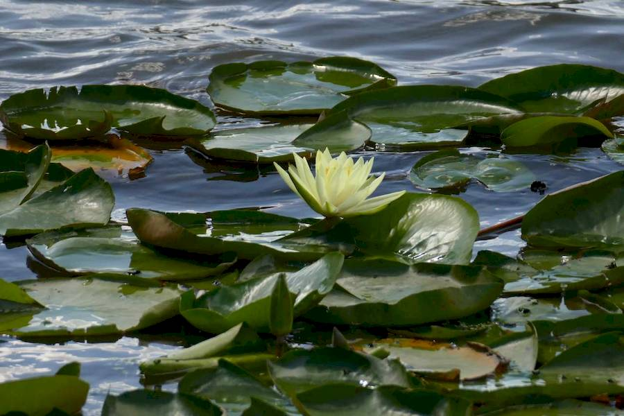
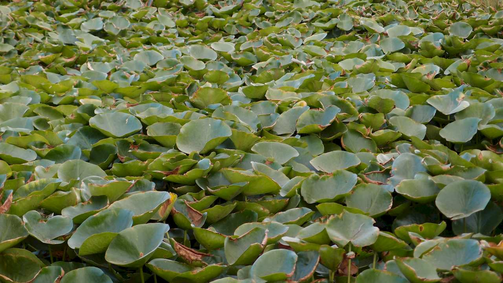

## Nymphaeaceae
# Nymphaea
 **Plant Form** Aquatic perennial with floating leaves. **Size** 50 cm to 2 m deep.

 *Magenta flowers - exotic species* 

 *Flowers have many colours* 

 *Closed flowers and leaves* 

 *Yellow flowers* 

 *Infestation in NT* 

