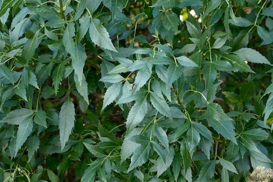

## Oleaceae
# Fraxinus angustifolia
**common names:** desert ash

**Plant Form** Large spreading deciduous tree. **Size** Up to 20 m tall. **Stem** Greyish, rough-barked trunk with prominent ridges. **Leaves** In opposite pairs of 3-9 leaflets with jagged edges and white midrib. **Flowers** Inconspicuous green to purple. **Fruit and Seeds** Large, drooping clusters of flat winged pods. **Habitat** Creeks, gullies, wetlands, parks and gardens. **Distinguishing Features** Seed pods are distinctive.

  
 *Foliage* 

  
 *Spring growth* 

  
 *Immature seeds* 

