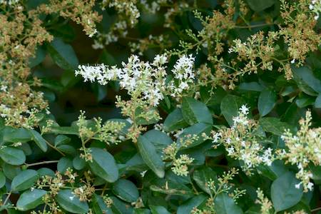
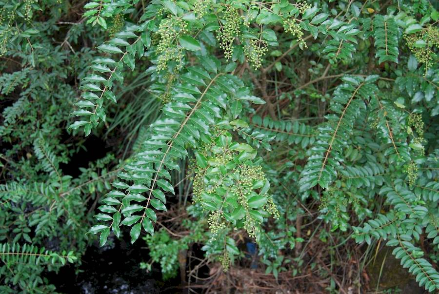
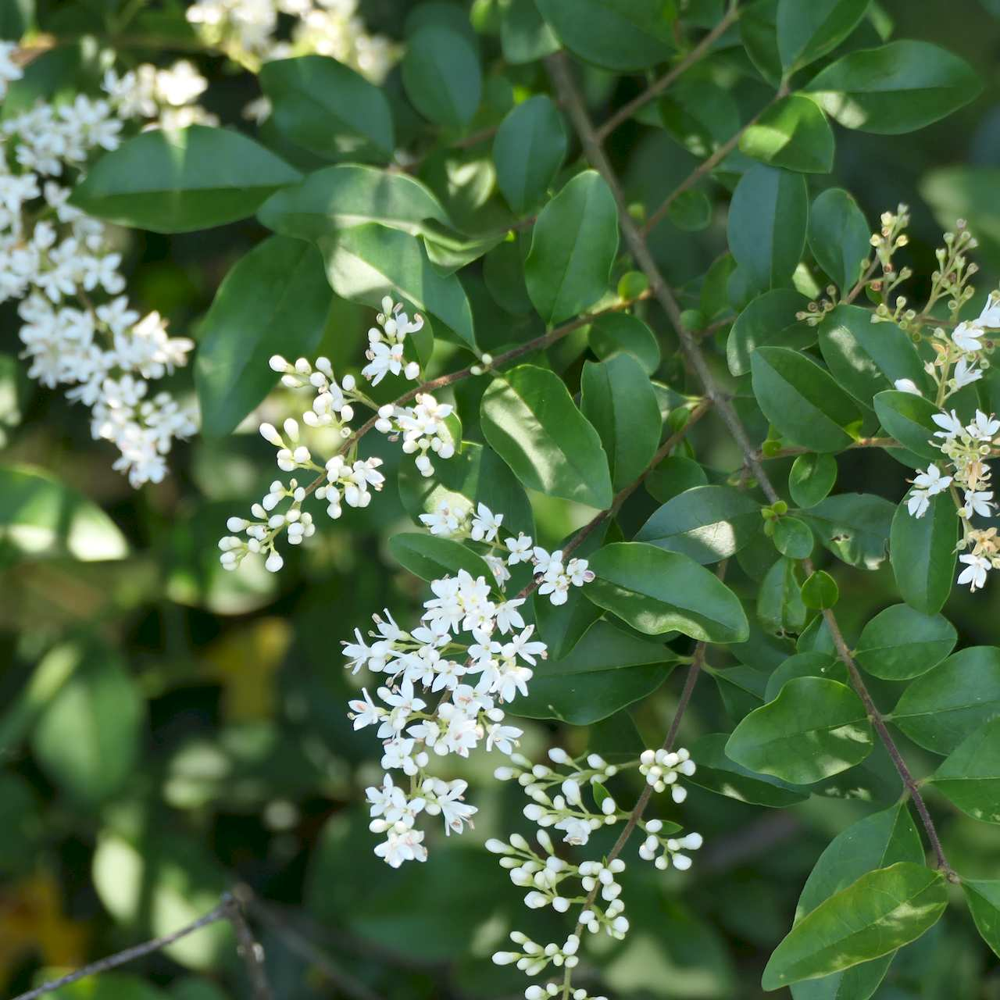
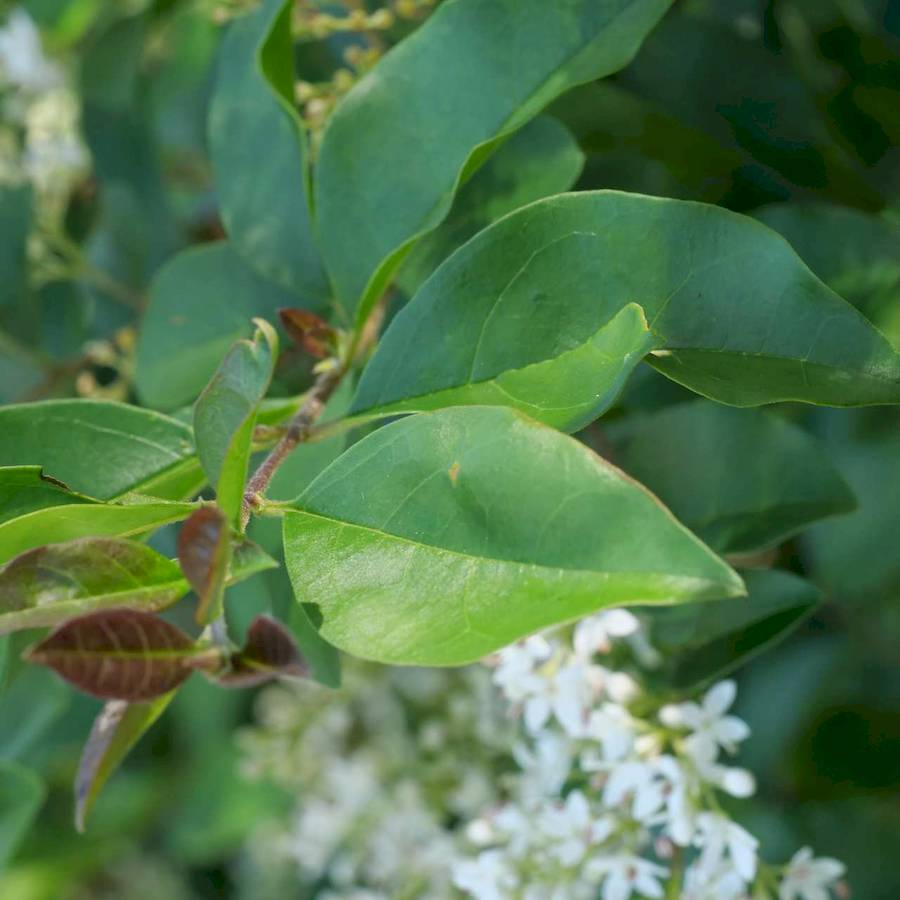
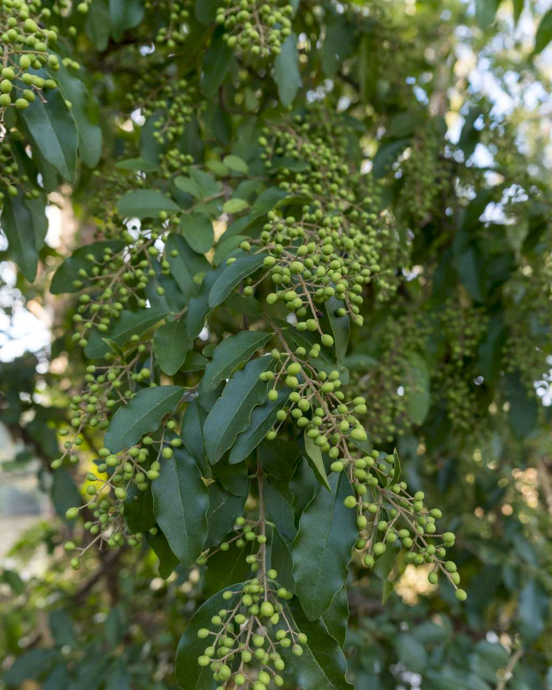

## Oleaceae
# Ligustrum sinense
**common names:** privet - narrow-leaf

**Plant Form** Large shrub or small tree. **Size** Up to 5m tall. **Stem** Hairy, rounded and greenish when young, turning greyish-brown and losing hairs with maturity. **Leaves** Oval shaped, oppositely arranged along stems, with smooth or wavy edges. Covered in fine hairs underneath, and with pointed tips. **Flowers** White or cream with 4 petals fused together into very short tube, in dense clusters at tips of branches. **Fruit and Seeds** Small round or egg shaped berry like with hard centre. Green to black with maturity. **Habitat** Rainforest, urban bushland, waste areas, old gardens. **Distinguishing Features** Smaller, more hairy leaves Broad-leaved privet, and keeps it's leaves over winter unlike Common privet.

  
 *Fresh and spent flowers* 

  
 *Leaves often in rows* 

  
 *Flowers* 

  
 *Leaf* 

  
 *Berries* 

