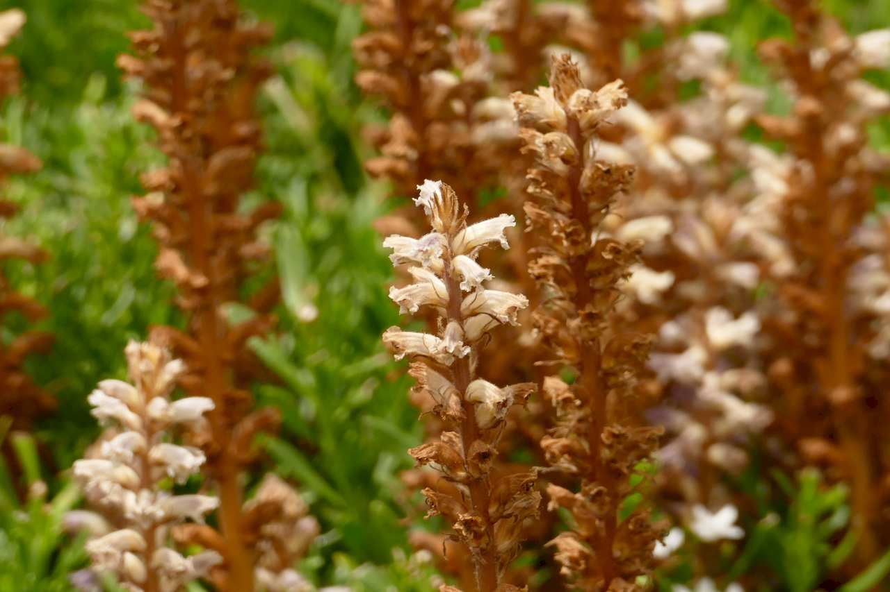
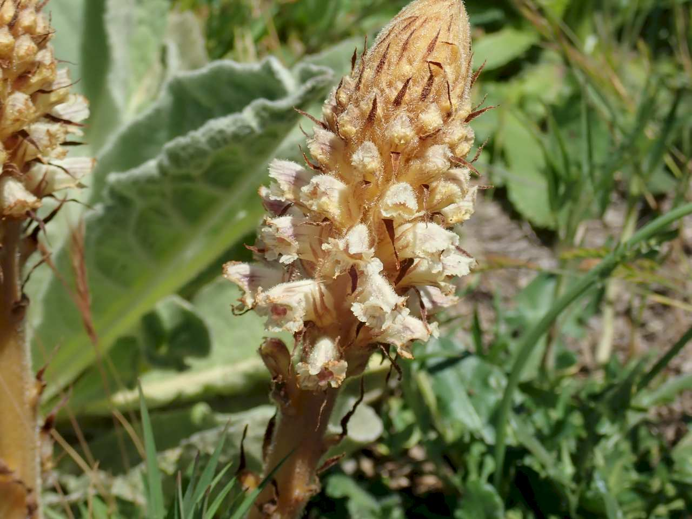
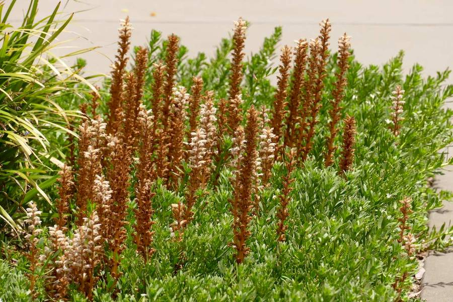

## Orobanchaceae
# Orobanche
**common names:** broomrapes

**Plant Form** Annual small parasitic herbs. **Size** Up to 30 cm tall. **Stem** Cream to yellow or brown with fine hairs, only flowering stem above ground. **Leaves** N/A **Flowers** Pale blue to violet, trumpet shaped, 1-2 cm long. **Fruit and Seeds** Dull yellowish brown, single capsule containing hundreds of tiny seeds. **Habitat** No habitat preference, based on host plants. **Distinguishing Features** Very distinct, lack of chlorophll. Introduced species can be distinguished from native by host plant, native Broomrapes prey on native plants only.

 *Brown flowers* 

 *Thick when just emerged* 

 *Does not have its own leaves* 

