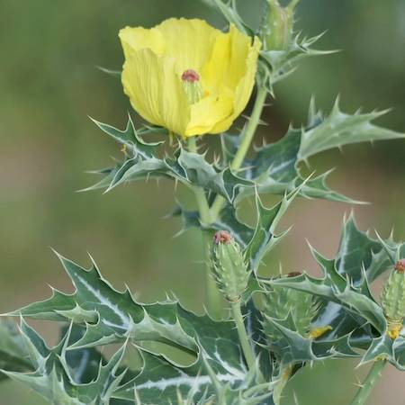

## Papaveraceae
# Argemone mexicana
 **Plant Form** Erect annual herb. **Size** Up to 1.5 m tall. **Stem** Green, up to 1 m long and smooth or slightly covered in hairs, with yellow prickles. **Leaves** Undivided, irregularly toothed to lobed, spiny, up to 12 cm long. **Flowers** Generally bright yellow, up to 7 cm diameter. **Fruit and Seeds** Capsules up to 40 mm long, with many large, dark seeds. **Habitat** Roadsides, degraded land. **Distinguishing Features** Darker coloured flowers and fewer spines on capsules than Mexican Poppy.

 *Flowers are an intense yellow* 

 *Mid-rib is white* 

 *rosette when small* 

 *0.5 m tall when mature* 

