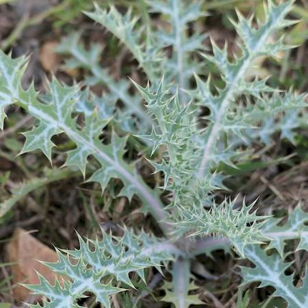

## Papaveraceae
# Argemone ochroleuca
**common names:** Mexican poppy

**Plant Form** Erect annual herb. **Size** Up to 1.5 m tall. **Stem** Bluish green, up to 1 m long and smooth or slightly covered in hairs, with yellow prickles. **Leaves** Undivided, irregularly toothed to lobed, spiny, up to 12 cm long. **Flowers** White to yellowish, up to 7 cm diameter. **Fruit and Seeds** Capsules up to 40 mm long, with many large, dark seeds. **Habitat** Roadsides, degraded land. **Distinguishing Features** Lighter coloured flowers and more spines on capsules than American Poppy.

 *Flower - light yellow* 

 *Foliage - seedling* 

 *Young seed pod* 

 *Infestation* 

