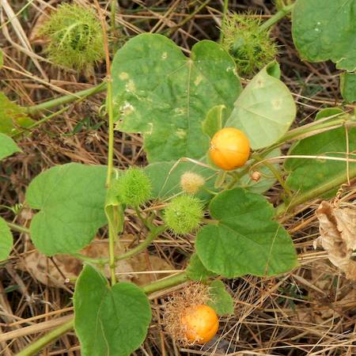

## Passifloraceae
# Passiflora foetida

**Plant Form** Climbing or scrambling vine. **Size** Climbs up to 9m high. **Stem** Cylindrical, scrambling, covered in fine or sticky hairs. **Leaves** Alternately arranged 3-10 cm long, usually with 3 pointed lobes, sometimes 5, often heart shaped at base **Flowers** Pinkish to purple and/or white, typical passionfruit shape. **Fruit and Seeds** Dry orange berries with prickly and sticky bracts. **Habitat** Pastures, agricultural land, wasteland, forests, gullies. **Distinguishing Features** Berries enclosed in sticky bracts, whole plant has unpleasant smell.

  
 *Flower* 

  
 *Ripe fruit* 

  
 *Unripe fruit are covered* 

  
 *Climbes over other plants* 

  
 *Leaves* 

